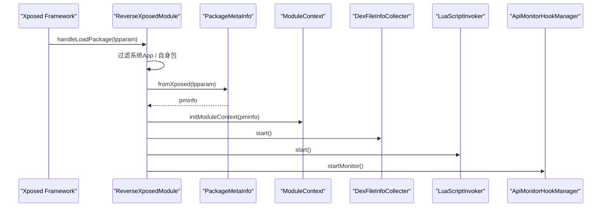

# 🚀 ReverseXposedModule

> Xposed 模块的最终入口点，负责在每个目标进程加载时执行过滤、初始化上下文、启动各功能子系统。

| 属性 | 值 |
|------|-----|
| 源码路径 | [ReverseXposedModule.java](https://github.com/android-security-engineer/ZjDroid-skills/blob/master/src/com/android/reverse/mod/ReverseXposedModule.java) |
| 类型 | 普通类（implements `IXposedHookLoadPackage`） |
| 所在包 | `com.android.reverse.mod` |
| 关键依赖 | `IXposedHookLoadPackage`、`ModuleContext`、`DexFileInfoCollecter`、`LuaScriptInvoker`、`ApiMonitorHookManager`、[PackageMetaInfo](/source/mod/PackageMetaInfo)、[Logger](/source/util/Logger) |

## 🎯 职责

`ReverseXposedModule` 是整个 ZjDroid 的 **Xposed 钩子入口**。Xposed 框架在每个 App 进程启动时都会回调 `handleLoadPackage()`，该类在此回调中：

1. **过滤不需要处理的进程**（系统 App、ZjDroid 自身）
2. **构建 PackageMetaInfo**，将 Xposed 的 `LoadPackageParam` 转换为项目内部数据模型
3. **依次启动**各采集与分析子系统

## 🔍 关键字段与方法

| 名称 | 类型 | 说明 |
|------|------|------|
| `ZJDROID_PACKAGENAME` | `static final String` | 自身包名 `com.android.reverse`，用于排除自身 |
| `handleLoadPackage(LoadPackageParam)` | 覆写方法 | Xposed 每次加载 App 时的唯一入口，包含所有初始化逻辑 |

## 🧠 关键实现

### 进程过滤三段逻辑

```java
public void handleLoadPackage(LoadPackageParam lpparam) throws Throwable {
    // ① 跳过系统 App 和系统更新 App
    if (lpparam.appInfo == null ||
            (lpparam.appInfo.flags & (ApplicationInfo.FLAG_SYSTEM
                    | ApplicationInfo.FLAG_UPDATED_SYSTEM_APP)) != 0) {
        return;
    // ② 仅处理 "第一个进程"（isFirstApplication）且不是模块自身
    } else if (lpparam.isFirstApplication
            && !ZJDROID_PACKAGENAME.equals(lpparam.packageName)) {
        Logger.PACKAGENAME = lpparam.packageName;
        Logger.log("the package = " + lpparam.packageName + " has hook");
        Logger.log("the app target id = " + android.os.Process.myPid());
        PackageMetaInfo pminfo = PackageMetaInfo.fromXposed(lpparam);
        ModuleContext.getInstance().initModuleContext(pminfo);
        DexFileInfoCollecter.getInstance().start();
        LuaScriptInvoker.getInstance().start();
        ApiMonitorHookManager.getInstance().startMonitor();
    } else {
        // ③ 其余情况（多进程副进程、自身进程）静默跳过
    }
}
```

::: info isFirstApplication 的含义
`LoadPackageParam.isFirstApplication` 为 `true` 表示当前是该应用的**主进程**（`android:process` 未指定或与包名相同的进程）。对于多进程 App，Xposed 会对每个进程都回调，使用此标志可确保初始化仅在主进程发生一次，避免重复或混乱。
:::

### 初始化链

```java
PackageMetaInfo pminfo = PackageMetaInfo.fromXposed(lpparam);  // 数据封装
ModuleContext.getInstance().initModuleContext(pminfo);          // 全局上下文初始化
DexFileInfoCollecter.getInstance().start();                     // DEX 文件信息采集
LuaScriptInvoker.getInstance().start();                        // Lua 脚本引擎启动
ApiMonitorHookManager.getInstance().startMonitor();            // API 监控 Hook 装载
```

::: tip 单例链式启动
四个子系统均以单例模式管理，`start()` / `startMonitor()` 内部负责具体的 Hook 注册，外部调用方（本类）只需顺序激活，职责清晰。
:::

## 🔗 调用关系



## 📌 小结

`ReverseXposedModule` 是一个轻量级的 **策略路由器**：它本身不执行任何分析逻辑，仅做三件事——过滤无关进程、打包上下文信息、依次激活子系统。这种设计让 Xposed 入口保持极度简洁，所有业务细节下沉到各自的子系统中，高度符合单一职责原则。
