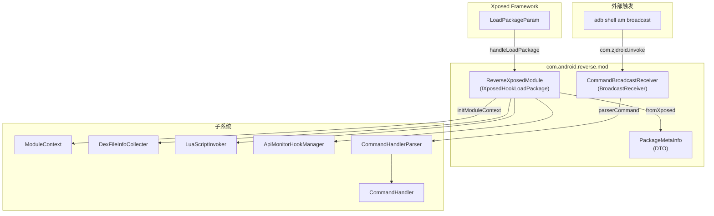
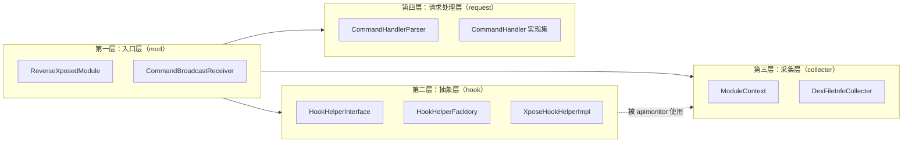

# 🏗️ 模块入口层（mod 包）

`com.android.reverse.mod` 是 ZjDroid 的**启动层与通信网关**。该包共包含 3 个类，负责完成从 Xposed 框架回调到内部系统初始化的全部桥接工作，以及接收外部控制指令的完整通路。

## 📋 包整体职责

| 职责 | 描述 |
|------|------|
| **Xposed 入口** | 实现 `IXposedHookLoadPackage`，接收 Xposed 对每个 App 进程的回调 |
| **进程过滤** | 排除系统 App 和模块自身，仅对目标用户 App 主进程初始化 |
| **上下文封装** | 将 Xposed 的 `LoadPackageParam` 转换为内部数据对象 `PackageMetaInfo` |
| **子系统激活** | 按序启动 `ModuleContext`、`DexFileInfoCollecter`、`LuaScriptInvoker`、`ApiMonitorHookManager` |
| **指令接收** | 通过广播接收器监听 adb 指令，按 PID 路由并异步执行 |

## 📁 类清单

| 类名 | 类型 | 一句话职责 |
|------|------|-----------|
| [ReverseXposedModule](/source/mod/ReverseXposedModule) | 普通类 | Xposed 入口，过滤进程并依次启动各子系统 |
| [PackageMetaInfo](/source/mod/PackageMetaInfo) | DTO 类 | 封装目标 App 元数据（包名、ClassLoader、ApplicationInfo 等） |
| [CommandBroadcastReceiver](/source/mod/CommandBroadcastReceiver) | BroadcastReceiver | 接收 `com.zjdroid.invoke` 广播，按 PID 路由并异步执行指令 |

## 🗺️ 包内关系图

## 📍 在整个项目中的位置

::: tip 阅读建议
建议按以下顺序阅读本包的三个类：

1. [PackageMetaInfo](/source/mod/PackageMetaInfo) — 先理解数据结构
2. [ReverseXposedModule](/source/mod/ReverseXposedModule) — 理解初始化流程
3. [CommandBroadcastReceiver](/source/mod/CommandBroadcastReceiver) — 理解运行时指令通路
:::
