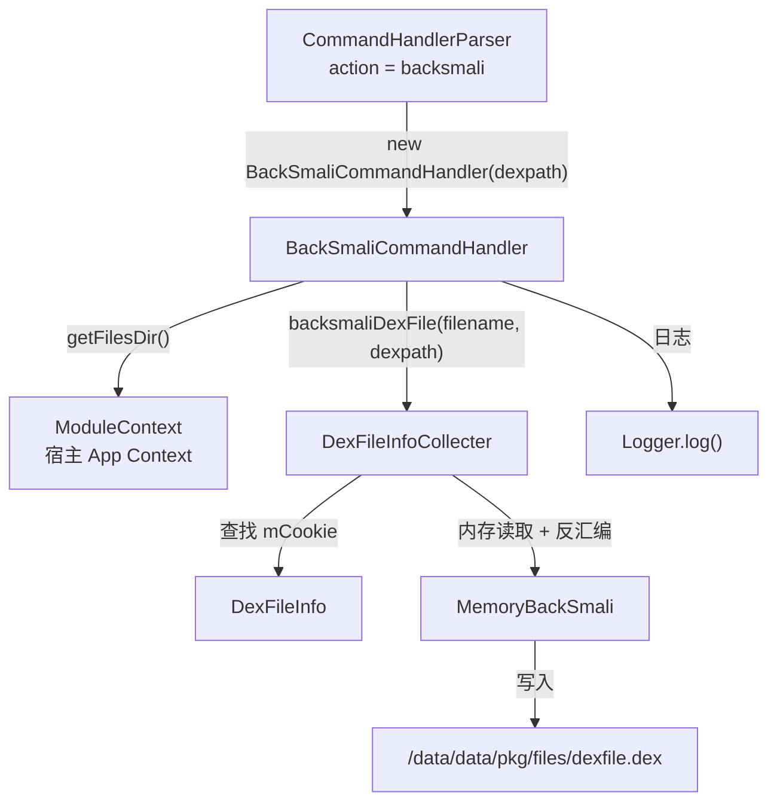

# 🔧 BackSmaliCommandHandler

> 响应 `backsmali` 指令，将目标 DEX 从内存 dump 并反汇编为 Smali 格式，输出到 `/data/data/<pkg>/files/dexfile.dex`。

| 属性 | 值 |
|------|-----|
| 源码路径 | [BackSmaliCommandHandler.java](https://github.com/android-security-engineer/ZjDroid-skills/blob/master/src/com/android/reverse/request/BackSmaliCommandHandler.java) |
| 类型 | `class`（implements CommandHandler） |
| 所在包 | `com.android.reverse.request` |
| 关键依赖 | `DexFileInfoCollecter`、`ModuleContext`、`Logger` |

## 🎯 职责

`BackSmaliCommandHandler` 是 ZjDroid 最核心的脱壳 + 反汇编 Handler。它触发 [DexFileInfoCollecter](/source/collecter/DexFileInfoCollecter) 的 `backsmaliDexFile()` 方法，将指定 DEX 文件从内存中提取出来（绕过壳的加密层），并通过内嵌的 baksmali 工具直接反汇编为 Smali 代码，是 ZjDroid 名称中 "Smali" 的由来。

## 🔍 关键字段与方法

| 成员 | 类型 | 说明 |
|------|------|------|
| `dexpath` | `String` | 目标 DEX 在文件系统中的路径，构造函数注入 |
| `BackSmaliCommandHandler(String dexpath)` | 构造函数 | 绑定目标 DEX 路径 |
| `doAction()` | `void` | 执行 backsmali，输出文件固定为 `dexfile.dex` |

## 🧠 关键实现

```java
public BackSmaliCommandHandler(String dexpath) {
    this.dexpath = dexpath;
}

@Override
public void doAction() {
    String filename = ModuleContext.getInstance().getAppContext().getFilesDir()+"/dexfile.dex";
    DexFileInfoCollecter.getInstance().backsmaliDexFile(filename, dexpath);
    Logger.log("the dexfile data save to ="+filename);
}
```

### 执行流程分析

1. **构建输出路径**：通过 `ModuleContext` 获取宿主 App 私有目录，拼接固定文件名 `dexfile.dex`（注意扩展名为 `.dex` 而非 `.odex`，与 [DumpDexFileCommandHandler](/source/request/DumpDexFileCommandHandler) 的 `dexdump.odex` 不同）。

2. **委托 backsmali 流程**：调用 [DexFileInfoCollecter](/source/collecter/DexFileInfoCollecter)`.backsmaliDexFile(filename, dexpath)`，该方法内部会：
   - 根据 `dexpath` 查找对应的 `mCookie`
   - 通过 native 接口从 Dalvik/ART 虚拟机内存中读取原始 DEX 字节
   - 调用内嵌的 [MemoryBackSmali](/source/smali/MemoryBackSmali) 对 DEX 进行反汇编处理

3. **日志告知**：打印输出文件路径。

::: info 与 DumpDexFileCommandHandler 的对比

| 特性 | `backsmali` | `dump_dexfile` |
|------|------------|----------------|
| 输出文件名 | `dexfile.dex` | `dexdump.odex` |
| 核心方法 | `backsmaliDexFile()` | `dumpDexFile()` |
| 主要用途 | Smali 反汇编分析 | 原始字节提取 |
| 适配工具 | baksmali / smali 工具链 | jadx、dex2jar 等 |

两种方式都能绕过壳的文件层保护，区别在于后续使用场景不同。
:::

::: tip 获取 Smali 代码的完整流程
1. 发送 `dump_dexinfo` 确认目标 DEX 路径
2. 发送 `backsmali` + 对应 `dexpath`
3. 从设备上 `adb pull /data/data/<pkg>/files/dexfile.dex .`
4. 用 `baksmali d dexfile.dex -o out/` 进行反汇编（如果 DexFileInfoCollecter 层未内部完成的话）
:::

## 🔗 调用关系



## 📌 小结

`BackSmaliCommandHandler` 是 ZjDroid 最核心的功能 Handler，一步完成内存提取与 Smali 反汇编，是其他静态分析工具无法触达的内存层逆向能力的集中体现。先用 [DumpDexInfoCommandHandler](/source/request/DumpDexInfoCommandHandler) 获取 `dexpath`，再调用本 Handler 是标准操作流程。
