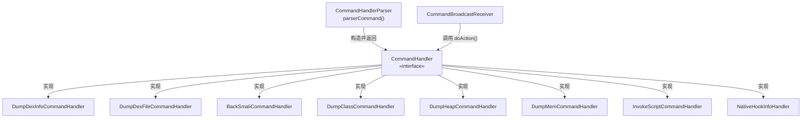

# 📜 CommandHandler

> 指令处理器统一接口，定义了所有具体 Handler 必须实现的唯一契约方法 `doAction()`。

| 属性 | 值 |
|------|-----|
| 源码路径 | [CommandHandler.java](https://github.com/android-security-engineer/ZjDroid-skills/blob/master/src/com/android/reverse/request/CommandHandler.java) |
| 类型 | `interface` |
| 所在包 | `com.android.reverse.request` |
| 关键依赖 | 无（纯接口） |

## 🎯 职责

`CommandHandler` 是整个**命令模式（Command Pattern）**的核心抽象。它规定：凡是能响应外部指令的类，都必须实现 `doAction()` 方法，从而使 [CommandHandlerParser](/source/request/CommandHandlerParser) 能以统一方式调用任意 Handler，无需关心具体实现细节。

## 🔍 关键字段与方法

| 成员 | 类型 | 说明 |
|------|------|------|
| `doAction()` | `abstract void` | 执行具体指令逻辑的唯一入口，无参数无返回值 |

## 🧠 关键实现

源码极为精简：

```java
package com.android.reverse.request;

public interface CommandHandler {	
    public abstract void doAction();
}
```

::: info 设计意图
接口只有一个方法，符合**单一职责原则（SRP）**和**接口隔离原则（ISP）**。所有副作用（文件写入、日志输出等）都发生在各 Handler 的 `doAction()` 实现内部，调用方无需感知。
:::

### 为什么不带参数？

指令所需的参数（如 dexpath、内存起始地址等）在 [CommandHandlerParser](/source/request/CommandHandlerParser) 解析阶段就已注入到各 Handler 的**构造函数**中，`doAction()` 调用时参数已就位，无需再传递。这是命令模式的经典用法：**参数前置绑定，执行时零耦合**。

## 🔗 调用关系



## 📌 小结

`CommandHandler` 是整个指令处理层的**基石**。它让 [CommandHandlerParser](/source/request/CommandHandlerParser) 与具体 Handler 解耦，新增指令类型只需新建实现类，无需修改分发逻辑以外的任何代码。参见 [CommandHandlerParser](/source/request/CommandHandlerParser) 了解分发细节。
