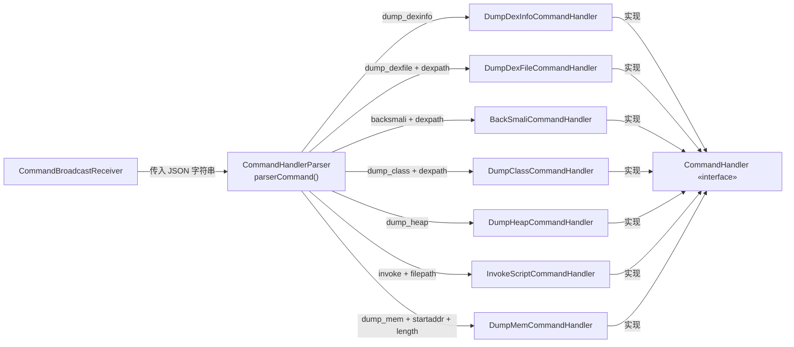

# 🔀 CommandHandlerParser

> 命令解析与分发中枢，将 JSON 字符串中的 `action` 字段映射到对应的 Handler 实例。

| 属性 | 值 |
|------|-----|
| 源码路径 | [CommandHandlerParser.java](https://github.com/android-security-engineer/ZjDroid-skills/blob/master/src/com/android/reverse/request/CommandHandlerParser.java) |
| 类型 | `class`（工具类，纯静态方法） |
| 所在包 | `com.android.reverse.request` |
| 关键依赖 | `org.json.JSONObject`、`Logger`、`InvokeScriptCommandHandler.ScriptType` |

## 🎯 职责

`CommandHandlerParser` 是整个**命令模式的入口**。它接收一条 JSON 格式的原始指令字符串，解析出 `action` 字段，并通过 if-else 链将控制权分发给对应的 [CommandHandler](/source/request/CommandHandler) 实现类。调用方（[CommandBroadcastReceiver](/source/mod/CommandBroadcastReceiver)）只需调用 `parserCommand(cmd)` 一个方法，无需了解任何具体 Handler 的存在。

## 🔍 关键字段与方法

| 成员 | 类型 | 说明 |
|------|------|------|
| `ACTION_NAME_KEY` | `static String` | JSON 键名 `"action"`，用于提取指令类型 |
| `ACTION_DUMP_DEXINFO` | `static String` | 值 `"dump_dexinfo"` |
| `ACTION_DUMP_HEAP` | `static String` | 值 `"dump_heap"` |
| `ACTION_DUMP_DEXCLASS` | `static String` | 值 `"dump_class"` |
| `ACTION_DUMP_DEXFILE` | `static String` | 值 `"dump_dexfile"` |
| `ACTION_BACKSMALI_DEXFILE` | `static String` | 值 `"backsmali"` |
| `ACTION_DUMP_MEMERY` | `static String` | 值 `"dump_mem"` |
| `ACTION_INVOKE_SCRIPT` | `static String` | 值 `"invoke"` |
| `PARAM_DEXPATH_DUMPDEXCLASS` | `static String` | 参数键 `"dexpath"`，多个分支共用 |
| `PARAM_DEXPATH_DUMP_DEXFILE` | `static String` | 参数键 `"dexpath"`（见下方警告） |
| `PARAM_START_DUMP_MEMERY` | `static String` | 参数键 `"startaddr"`（见下方警告） |
| `PARAM_LENGTH_DUMP_MEMERY` | `static String` | 参数键 `"length"` |
| `FILE_SCRIPT` | `static String` | 参数键 `"filepath"` |
| `parserCommand(String cmd)` | `static CommandHandler` | 解析 JSON 并返回对应 Handler，失败返回 `null` |

## 🧠 关键实现

### 1. JSON 解析与 action 提取

```java
public static CommandHandler parserCommand(String cmd) {
    CommandHandler handler = null;
    try {
        JSONObject jsoncmd = new JSONObject(cmd);
        String action = jsoncmd.getString(ACTION_NAME_KEY);
        Logger.log("the cmd = " + action);
        // ...分发逻辑...
    } catch (JSONException e) {
        e.printStackTrace();
    }
    return handler;
}
```

方法用 `try-catch` 包裹整个 JSON 解析过程，`JSONException` 仅打印堆栈而不向上抛出，此时 `handler` 保持 `null`，调用方需做空值判断。

### 2. if-else 分发链（7 个 action）

```java
if (ACTION_DUMP_DEXINFO.equals(action)) {
    handler = new DumpDexInfoCommandHandler();

} else if (ACTION_DUMP_DEXFILE.equals(action)) {
    if (jsoncmd.has(PARAM_DEXPATH_DUMPDEXCLASS)) {
        String dexpath = jsoncmd.getString(PARAM_DEXPATH_DUMPDEXCLASS);
        handler = new DumpDexFileCommandHandler(dexpath);
    }

} else if (ACTION_BACKSMALI_DEXFILE.equals(action)) {
    if (jsoncmd.has(PARAM_DEXPATH_DUMPDEXCLASS)) {
        String dexpath = jsoncmd.getString(PARAM_DEXPATH_DUMPDEXCLASS);
        handler = new BackSmaliCommandHandler(dexpath);
    }

} else if (ACTION_DUMP_DEXCLASS.equals(action)) {
    if (jsoncmd.has(PARAM_DEXPATH_DUMPDEXCLASS)) {
        String dexpath = jsoncmd.getString(PARAM_DEXPATH_DUMP_DEXFILE); // ← 注意此处
        handler = new DumpClassCommandHandler(dexpath);
    }

} else if (ACTION_DUMP_HEAP.equals(action)) {
    handler = new DumpHeapCommandHandler();

} else if (ACTION_INVOKE_SCRIPT.equals(action)) {
    if (jsoncmd.has(FILE_SCRIPT)) {
        String filepath = jsoncmd.getString(FILE_SCRIPT);
        handler = new InvokeScriptCommandHandler(filepath, ScriptType.FILETYPE);
    }

} else if (ACTION_DUMP_MEMERY.equals(action)) {
    int start = jsoncmd.getInt(PARAM_START_DUMP_MEMERY);
    int length = jsoncmd.getInt(PARAM_LENGTH_DUMP_MEMERY);
    handler = new DumpMemCommandHandler(start, length);
}
```

::: warning 源码中的两处值得关注的细节

**细节 1：`dump_class` 分支使用了不同名常量但值相同**

在 `ACTION_DUMP_DEXCLASS` 分支中，`jsoncmd.has()` 用的是 `PARAM_DEXPATH_DUMPDEXCLASS`，而 `jsoncmd.getString()` 用的是 `PARAM_DEXPATH_DUMP_DEXFILE`：

```java
// 第 53-55 行
if (jsoncmd.has(PARAM_DEXPATH_DUMPDEXCLASS)) {
    String dexpath = jsoncmd.getString(PARAM_DEXPATH_DUMP_DEXFILE);
```

两个常量的**值**均为 `"dexpath"`，所以运行时行为正确，但命名上属于笔误/遗留问题，阅读时容易造成困惑。

**细节 2：`dump_mem` 的起始地址参数键是 `"startaddr"` 而非 `"start"`**

```java
private static String PARAM_START_DUMP_MEMERY = "startaddr";
```

ZjDroid 的 README 文档中将该参数写作 `start`，这是**文档错误**。实际发送 `dump_mem` 指令时必须使用 `startaddr` 作为键名，否则 `jsoncmd.getInt()` 会抛出 `JSONException`。
:::

### 3. 参数缺失时的处理

对于需要参数的分支（`dump_dexfile`、`backsmali`、`dump_class`、`invoke`），代码先用 `jsoncmd.has()` 判断键是否存在，缺少时打印日志并让 `handler` 保持 `null`，不会创建 Handler。

对于 `dump_mem` 分支，代码直接调用 `jsoncmd.getInt()`，若键缺失则触发 `JSONException` 并被 catch 捕获。

## 🔗 调用关系



## 📌 小结

`CommandHandlerParser` 是整个指令层的**神经中枢**：它是唯一知道所有具体 Handler 存在的地方，通过 if-else 链实现了一个简单而有效的**工厂 + 分发**机制。注意两处历史遗留细节：`dump_class` 分支的双常量命名笔误（值相同无影响）以及 `dump_mem` 的参数键名与 README 文档不一致（`"startaddr"` vs `"start"`）。
