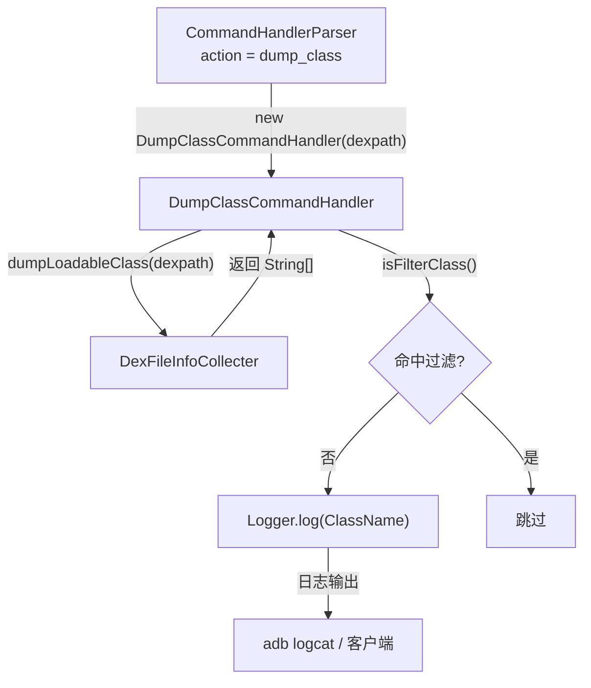

# 🗂️ DumpClassCommandHandler

> 响应 `dump_class` 指令，枚举指定 DEX 中所有可加载类名（自动过滤框架类与工具类）并输出日志。

| 属性 | 值 |
|------|-----|
| 源码路径 | [DumpClassCommandHandler.java](https://github.com/android-security-engineer/ZjDroid-skills/blob/master/src/com/android/reverse/request/DumpClassCommandHandler.java) |
| 类型 | `class`（implements CommandHandler） |
| 所在包 | `com.android.reverse.request` |
| 关键依赖 | `DexFileInfoCollecter`、`Logger` |

## 🎯 职责

`DumpClassCommandHandler` 帮助分析人员**快速了解目标 DEX 的类组成**：在脱壳或 backsmali 之前，先枚举出所有类名，确认关键业务类是否存在、确认 DEX 是否正确，避免白做 dump 操作。

## 🔍 关键字段与方法

| 成员 | 类型 | 说明 |
|------|------|------|
| `dexpath` | `String` | 目标 DEX 路径，构造函数注入 |
| `filterClassName` | `String[]` | 固定过滤前缀列表（4 个条目） |
| `DumpClassCommandHandler(String dexpath)` | 构造函数 | 绑定目标 DEX 路径 |
| `doAction()` | `void` | 枚举并打印过滤后的类名列表 |
| `isFilterClass(String className)` | `private boolean` | 判断某类名是否命中过滤列表 |

## 🧠 关键实现

### 1. 类名枚举

```java
@Override
public void doAction() {
    String[] loadClass = DexFileInfoCollecter.getInstance().dumpLoadableClass(dexpath);
    if (loadClass != null) {
        Logger.log("Start Loadable ClassName ->");
        String className = null;
        for (int i = 0; i < loadClass.length; i++) {
            className = loadClass[i];
            if (!this.isFilterClass(className)) {
                Logger.log("ClassName = " + className);
            }
        }
        Logger.log("End Loadable ClassName");
    } else {
        Logger.log("Can't find class loaded by the dex");
    }
}
```

调用 [DexFileInfoCollecter](/source/collecter/DexFileInfoCollecter)`.dumpLoadableClass(dexpath)` 获取类名数组，逐条过滤后打印。若返回 `null`（未找到匹配的 DEX），则输出提示信息。

### 2. 过滤机制

```java
private final String[] filterClassName = {
    "android.support.v4.",
    "com.android.reverse.",
    "org.jf.",
    "org.keplerproject."
};

private boolean isFilterClass(String className) {
    String filterName = null;
    for (int i = 0; i < filterClassName.length; i++) {
        filterName = filterClassName[i];
        if (className.startsWith(filterName)) {
            return true;
        }
    }
    return false;
}
```

过滤的四个前缀含义：

| 前缀 | 过滤理由 |
|------|---------|
| `android.support.v4.` | Android Support Library，非业务代码 |
| `com.android.reverse.` | ZjDroid 模块自身的类，避免自污染 |
| `org.jf.` | dexlib/baksmali 库，内嵌工具类 |
| `org.keplerproject.` | LuaJava 库，内嵌工具类 |

::: tip 过滤策略
过滤设计合理：既排除了 ZjDroid 自身代码，又排除了内嵌工具链类，使输出结果聚焦在**目标 App 的业务代码**上。但注意该过滤是前缀匹配，如果目标 App 的包名恰好以这些前缀开头，则会被误过滤。
:::

::: warning 参数键名笔误说明（源码层面）

在 [CommandHandlerParser](/source/request/CommandHandlerParser) 的 `dump_class` 分支中，存在一处常量名混用：

```java
// CommandHandlerParser.java 第 53-55 行
if (jsoncmd.has(PARAM_DEXPATH_DUMPDEXCLASS)) {
    String dexpath = jsoncmd.getString(PARAM_DEXPATH_DUMP_DEXFILE); // ← 用的是 DUMP_DEXFILE 的常量名
    handler = new DumpClassCommandHandler(dexpath);
}
```

`PARAM_DEXPATH_DUMPDEXCLASS` 和 `PARAM_DEXPATH_DUMP_DEXFILE` 的值均为 `"dexpath"`，因此运行时完全正常。这是命名上的遗留笔误，不影响功能。

实际发送 `dump_class` 指令时，参数键仍为 `"dexpath"`：

```json
{"action": "dump_class", "dexpath": "/data/app/com.target.app-1/base.apk"}
```
:::

## 🔗 调用关系



## 📌 小结

`DumpClassCommandHandler` 是一个只读的侦察型 Handler，通过内置过滤机制专注输出目标 App 的业务类名。在执行 `dump_dexfile` 或 `backsmali` 之前，建议先运行此指令确认 DEX 内容符合预期。注意 [CommandHandlerParser](/source/request/CommandHandlerParser) 中存在常量名笔误，但不影响运行时行为。
