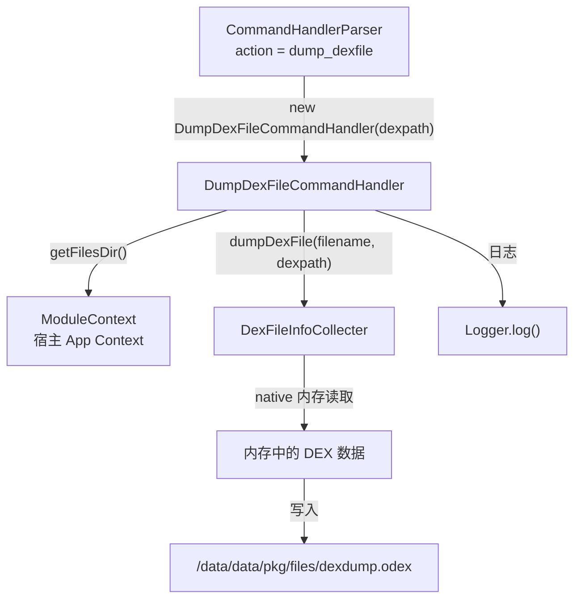

# 💾 DumpDexFileCommandHandler

> 响应 `dump_dexfile` 指令，将目标 DEX 文件的内存镜像 dump 到 `/data/data/<pkg>/files/dexdump.odex`。

| 属性 | 值 |
|------|-----|
| 源码路径 | [DumpDexFileCommandHandler.java](https://github.com/android-security-engineer/ZjDroid-skills/blob/master/src/com/android/reverse/request/DumpDexFileCommandHandler.java) |
| 类型 | `class`（implements CommandHandler） |
| 所在包 | `com.android.reverse.request` |
| 关键依赖 | `DexFileInfoCollecter`、`ModuleContext`、`Logger` |

## 🎯 职责

`DumpDexFileCommandHandler` 是 ZjDroid 脱壳功能的核心入口之一。它接收目标 DEX 的文件路径作为参数，从内存中读取该 DEX 的真实字节数据（已经过解壳），并写入到 `.odex` 文件中，供分析人员离线分析。

## 🔍 关键字段与方法

| 成员 | 类型 | 说明 |
|------|------|------|
| `dexpath` | `String` | 目标 DEX 在文件系统中的路径，由构造函数注入 |
| `DumpDexFileCommandHandler(String dexpath)` | 构造函数 | 绑定目标 DEX 路径 |
| `doAction()` | `void` | 执行 dump，输出文件固定为 `dexdump.odex` |

## 🧠 关键实现

```java
public DumpDexFileCommandHandler(String dexpath) {
    this.dexpath = dexpath;
}

@Override
public void doAction() {
    String filename = ModuleContext.getInstance().getAppContext().getFilesDir()+"/dexdump.odex";
    DexFileInfoCollecter.getInstance().dumpDexFile(filename, dexpath);
    Logger.log("the dexfile data save to ="+filename);
}
```

### 执行流程分析

1. **构建输出路径**：通过 `ModuleContext.getInstance().getAppContext().getFilesDir()` 获取宿主 App 的私有文件目录（通常为 `/data/data/<包名>/files`），拼接固定文件名 `dexdump.odex`。

2. **委托 Collecter 执行 dump**：调用 [DexFileInfoCollecter](/source/collecter/DexFileInfoCollecter)`.dumpDexFile(filename, dexpath)`，由 Collecter 层负责根据 `dexpath` 找到对应的 `mCookie`，再通过 native 调用将内存中的 DEX 字节序列写入文件。

3. **日志通知**：打印输出文件路径，告知分析人员去哪里取结果。

::: tip 输出文件命名
输出文件名**固定**为 `dexdump.odex`（.odex 扩展名是历史遗留，内容实际上是标准 DEX 格式），多次执行会覆盖上一次的结果。若需保留多个 DEX 的 dump，需手动重命名。
:::

::: info 与 BackSmaliCommandHandler 的区别
`DumpDexFileCommandHandler` 输出的是**原始 DEX 字节**（适合 dex2jar、jadx 等工具进一步分析）；而 [BackSmaliCommandHandler](/source/request/BackSmaliCommandHandler) 输出的也是 DEX 字节但走不同的代码路径（`backsmaliDexFile`），主要服务于 Smali 反汇编场景。两者互补。
:::

::: warning 参数键名确认
在 JSON 指令中，DEX 路径参数键为 `"dexpath"`（对应常量 `PARAM_DEXPATH_DUMPDEXCLASS`，值为 `"dexpath"`），需先通过 `dump_dexinfo` 确认路径：

```json
{"action": "dump_dexfile", "dexpath": "/data/app/com.target.app-1/base.apk"}
```
:::

## 🔗 调用关系



## 📌 小结

`DumpDexFileCommandHandler` 是最直接的脱壳 Handler：给它一个 DEX 路径，它就把内存中的 DEX 原始字节保存到本地文件。输出路径固定，注意多次执行会覆盖。配合 [DumpDexInfoCommandHandler](/source/request/DumpDexInfoCommandHandler) 先获取路径，再执行本指令，是标准的两步脱壳流程。
