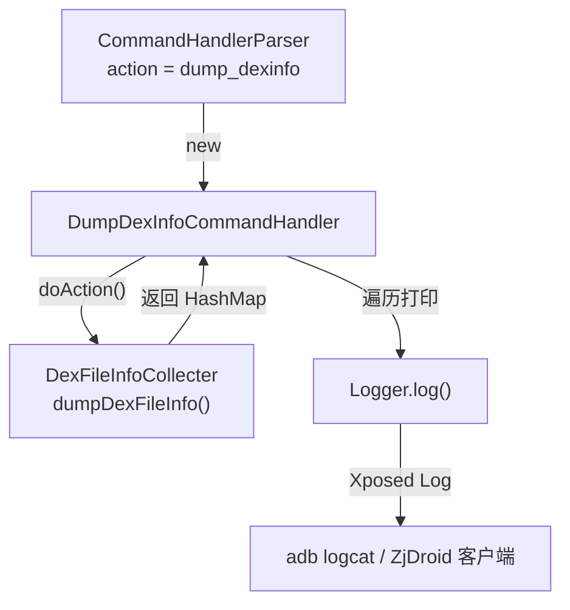

# 📋 DumpDexInfoCommandHandler

> 响应 `dump_dexinfo` 指令，枚举目标进程中所有已加载 DEX 文件的路径与 mCookie 并输出日志。

| 属性 | 值 |
|------|-----|
| 源码路径 | [DumpDexInfoCommandHandler.java](https://github.com/android-security-engineer/ZjDroid-skills/blob/master/src/com/android/reverse/request/DumpDexInfoCommandHandler.java) |
| 类型 | `class`（implements CommandHandler） |
| 所在包 | `com.android.reverse.request` |
| 关键依赖 | `DexFileInfoCollecter`、`DexFileInfo`、`Logger` |

## 🎯 职责

`DumpDexInfoCommandHandler` 是最轻量的 Handler 之一，无需任何构造参数。它调用 [DexFileInfoCollecter](/source/collecter/DexFileInfoCollecter) 获取当前进程所有 DEX 文件的元数据（路径 + mCookie），通过 `Logger` 输出，是逆向分析的**第一步侦察**：帮助分析人员确认目标 DEX 的文件路径，供后续 `dump_dexfile`、`backsmali` 等指令使用。

## 🔍 关键字段与方法

| 成员 | 类型 | 说明 |
|------|------|------|
| `doAction()` | `void` | 遍历所有 DEX 信息并逐条打印 filepath 和 mCookie |

## 🧠 关键实现

```java
@Override
public void doAction() {
    HashMap<String, DexFileInfo> dexfileInfo = DexFileInfoCollecter.getInstance().dumpDexFileInfo();
    Iterator<DexFileInfo> itor = dexfileInfo.values().iterator();
    DexFileInfo info = null;
    Logger.log("The DexFile Infomation ->");
    while (itor.hasNext()) {
        info = itor.next();
        Logger.log("filepath:"+ info.getDexPath()+" mCookie:"+info.getmCookie());
    }
    Logger.log("End DexFile Infomation");
}
```

### 执行流程分析

1. **获取快照**：调用 `DexFileInfoCollecter.getInstance().dumpDexFileInfo()` 返回一个以 DEX 路径为键、`DexFileInfo` 为值的 `HashMap`。
2. **遍历输出**：用迭代器遍历所有值，每条记录打印两个关键字段：
   - `getDexPath()`：DEX 文件在文件系统上的绝对路径（供后续指令使用）
   - `getmCookie()`：Dalvik/ART 内部用于标识已加载 DexFile 的 native 句柄，是后续内存 dump 操作的核心锚点
3. **边界标记**：用 `"The DexFile Infomation ->"` 和 `"End DexFile Infomation"` 包裹输出，便于从日志中快速定位结果。

::: tip 使用场景
在对陌生 APK 执行逆向时，应**优先发送 `dump_dexinfo` 指令**，确认目标 DEX 的路径（如 `/data/app/com.target/.../classes.dex`），再将该路径作为 `dexpath` 参数传给 `dump_dexfile` 或 `backsmali` 指令。
:::

::: info mCookie 的意义
`mCookie` 是 `dalvik.system.DexFile` 对象内部保存的 native 指针（在 Dalvik 中为 `int`，ART 中为 `long`），指向 native 层的 `DexFile` 结构体。ZjDroid 借助 Xposed Hook 在 DEX 加载时收集该值，后续 native 内存操作需要通过它定位 DEX 数据。
:::

## 🔗 调用关系



## 📌 小结

`DumpDexInfoCommandHandler` 是一个零参数、只读的侦察型 Handler：它不写文件、不修改内存，仅通过日志输出帮助分析人员建立对目标进程 DEX 加载状态的全局认识。参见 [DexFileInfoCollecter](/source/collecter/DexFileInfoCollecter) 了解数据如何收集。
