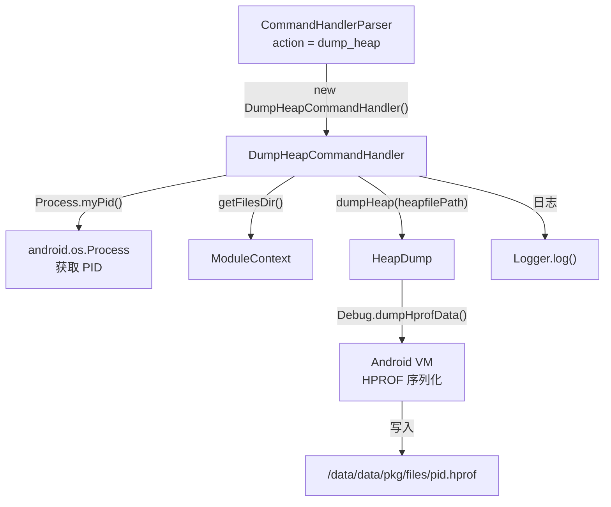

# 🗑️ DumpHeapCommandHandler

> 响应 `dump_heap` 指令，触发目标进程的堆内存快照（HPROF），输出到 `/data/data/<pkg>/files/<pid>.hprof`。

| 属性 | 值 |
|------|-----|
| 源码路径 | [DumpHeapCommandHandler.java](https://github.com/android-security-engineer/ZjDroid-skills/blob/master/src/com/android/reverse/request/DumpHeapCommandHandler.java) |
| 类型 | `class`（implements CommandHandler） |
| 所在包 | `com.android.reverse.request` |
| 关键依赖 | `HeapDump`、`ModuleContext`、`Logger` |

## 🎯 职责

`DumpHeapCommandHandler` 是 ZjDroid 中唯一专注于**堆内存分析**的 Handler。它不针对 DEX 文件，而是触发 Android 虚拟机的 HPROF 堆快照功能，将当前进程所有存活对象的内存布局序列化为标准 HPROF 文件，供 MAT（Memory Analyzer Tool）、VisualVM、Android Studio Profiler 等工具分析对象引用、查找内存泄漏，或用于逆向分析关键对象的字段值。

## 🔍 关键字段与方法

| 成员 | 类型 | 说明 |
|------|------|------|
| `dumpFileName` | `static String` | 输出文件名，格式为 `<pid>.hprof`（注意是 static 字段） |
| `DumpHeapCommandHandler()` | 构造函数 | 以当前进程 PID 生成文件名 |
| `doAction()` | `void` | 执行 HPROF dump |

## 🧠 关键实现

```java
private static String dumpFileName;

public DumpHeapCommandHandler() {
    dumpFileName = android.os.Process.myPid()+".hprof";
}

@Override
public void doAction() {
    String heapfilePath = ModuleContext.getInstance().getAppContext().getFilesDir()+"/"+dumpFileName;
    HeapDump.dumpHeap(heapfilePath);
    Logger.log("the heap data save to ="+ heapfilePath);
}
```

### 执行流程分析

1. **PID 命名策略**：构造函数调用 `android.os.Process.myPid()` 获取当前进程 PID，拼接 `.hprof` 扩展名作为文件名（如 `12345.hprof`）。使用 PID 命名可以在多进程环境中区分不同进程的 heap dump。

2. **构建输出路径**：拼接到宿主 App 私有文件目录，如 `/data/data/<pkg>/files/12345.hprof`。

3. **委托 HeapDump 执行**：调用 `HeapDump.dumpHeap(heapfilePath)`，该方法内部调用 Android 的 `Debug.dumpHprofData()` API，触发虚拟机生成 HPROF 格式堆快照。

::: warning static 字段的潜在问题
注意 `dumpFileName` 被声明为 `static`：

```java
private static String dumpFileName;
```

这意味着如果在同一进程中创建多个 `DumpHeapCommandHandler` 实例，后一个构造函数的赋值会覆盖前一个。在 ZjDroid 的使用场景中（每次收到 broadcast 创建新实例），这通常不构成问题，因为 PID 在进程生命周期内不变，每次生成的文件名相同，多次执行会覆盖上一次结果。
:::

::: info HPROF 文件的用途
HPROF 是 Java 标准的堆转储格式，可用于：
- **MAT（Eclipse Memory Analyzer）**：分析对象引用链、查找内存泄漏
- **Android Studio Profiler**：可视化堆对象分布
- **逆向分析**：在运行时找到加密密钥、解密后的字符串等保存在堆对象字段中的敏感数据
:::

::: tip 操作提示
dump_heap 的等待时间通常比其他 Handler 长（大型 App 的堆可能有数百 MB），执行后稍等片刻再通过 adb pull 取出文件：

```bash
adb pull /data/data/<target_pkg>/files/<pid>.hprof .
# 用 hprof-conv 转换为标准格式（Android HPROF 与标准 HPROF 有差异）
hprof-conv <pid>.hprof converted.hprof
```
:::

## 🔗 调用关系



## 📌 小结

`DumpHeapCommandHandler` 是唯一针对**堆内存**而非 DEX 文件的 Handler，无需参数，执行后生成以 PID 命名的 HPROF 文件。注意 `dumpFileName` 为 `static` 字段，多次调用会覆盖同名文件。HPROF 文件需用 `hprof-conv` 转换后才能被大多数工具正确解析。
