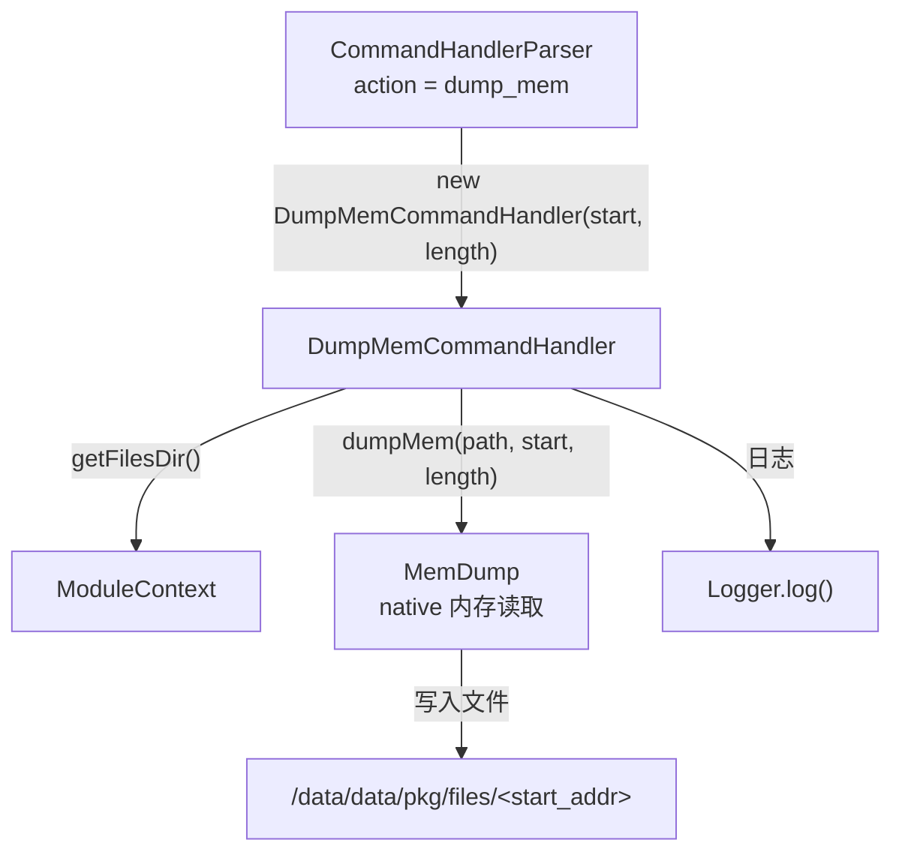

# 🧲 DumpMemCommandHandler

> 响应 `dump_mem` 指令，将指定内存地址起始的连续字节段 dump 到本地文件，用于低层内存取证分析。

| 属性 | 值 |
|------|-----|
| 源码路径 | [DumpMemCommandHandler.java](https://github.com/android-security-engineer/ZjDroid-skills/blob/master/src/com/android/reverse/request/DumpMemCommandHandler.java) |
| 类型 | `class`（implements CommandHandler） |
| 所在包 | `com.android.reverse.request` |
| 关键依赖 | `MemDump`、`ModuleContext`、`Logger` |

## 🎯 职责

`DumpMemCommandHandler` 是最底层、最直接的内存取证 Handler。与基于 DEX 路径的其他 Handler 不同，它直接操作**原始内存地址**：给定起始地址（整数）和长度（字节数），提取对应的内存段并写入文件。适用于需要精确定位特定内存区域（如堆对象、native 映射段）的高级逆向场景。

## 🔍 关键字段与方法

| 成员 | 类型 | 说明 |
|------|------|------|
| `dumpFileName` | `String` | 输出文件名，值等于 `start` 地址的字符串形式 |
| `start` | `int` | 内存起始地址（以整数形式传入） |
| `length` | `int` | 要 dump 的字节数 |
| `DumpMemCommandHandler(int start, int length)` | 构造函数 | 绑定地址和长度，生成文件名 |
| `doAction()` | `void` | 执行内存 dump，输出到以起始地址命名的文件 |

## 🧠 关键实现

```java
public DumpMemCommandHandler(int start, int length){
    this.start = start;
    this.length = length;
    this.dumpFileName = String.valueOf(start);
}

@Override
public void doAction() {
    String memfilePath = ModuleContext.getInstance().getAppContext().getFilesDir()+"/"+dumpFileName;
    MemDump.dumpMem(memfilePath, start, length);       
    Logger.log("the mem data save to ="+ memfilePath);
}
```

### 执行流程分析

1. **文件名生成策略**：`dumpFileName` 直接取 `start` 地址的十进制字符串（如地址 `0x12345678` = `305419896`，文件名就是 `305419896`）。这样既避免了文件名冲突，又方便追溯是哪块内存的 dump。

2. **构建输出路径**：拼接到宿主 App 私有文件目录下，如 `/data/data/<pkg>/files/305419896`。

3. **委托 MemDump 执行**：调用 `MemDump.dumpMem(memfilePath, start, length)`，该方法通过 native 接口直接读取进程虚拟地址空间中从 `start` 开始的 `length` 字节并写入文件。

::: warning README 参数键名错误

ZjDroid 官方 README 文档将 `dump_mem` 的起始地址参数键写作 `start`，这是**文档错误**。

查阅 [CommandHandlerParser](/source/request/CommandHandlerParser) 源码第 24 行：

```java
private static String PARAM_START_DUMP_MEMERY = "startaddr";
```

实际分发时使用的是 `jsoncmd.getInt(PARAM_START_DUMP_MEMERY)`，因此正确的参数键是 **`startaddr`**。

正确的 JSON 格式：
```json
{"action": "dump_mem", "startaddr": 305419896, "length": 4096}
```

若误用 `start` 键，`jsoncmd.getInt("startaddr")` 将抛出 `JSONException`，整条指令静默失败。
:::

::: info start 参数类型
`start` 以 Java `int` 类型存储，范围为 `-2147483648` 到 `2147483647`（即无符号 0x00000000 到 0xFFFFFFFF）。对于 32 位 Android 进程，`int` 足够覆盖整个用户空间地址范围。如传入负数，则会被 native 层解释为高位地址（如 `0x80000000` 以上）。
:::

::: tip 如何获取目标内存地址
通常配合 [DumpDexInfoCommandHandler](/source/request/DumpDexInfoCommandHandler) 返回的 `mCookie` 值（即 native DexFile 指针），或通过 Lua 脚本（`invoke` 指令）在运行时计算目标对象地址后再执行 `dump_mem`。
:::

## 🔗 调用关系



## 📌 小结

`DumpMemCommandHandler` 是最灵活的底层取证工具，可提取进程内存中任意地址段的数据。使用时牢记参数键名为 `"startaddr"`（非 README 所写的 `"start"`），地址值为十进制整数。是高级逆向分析和自定义脚本配合使用的强力工具。
