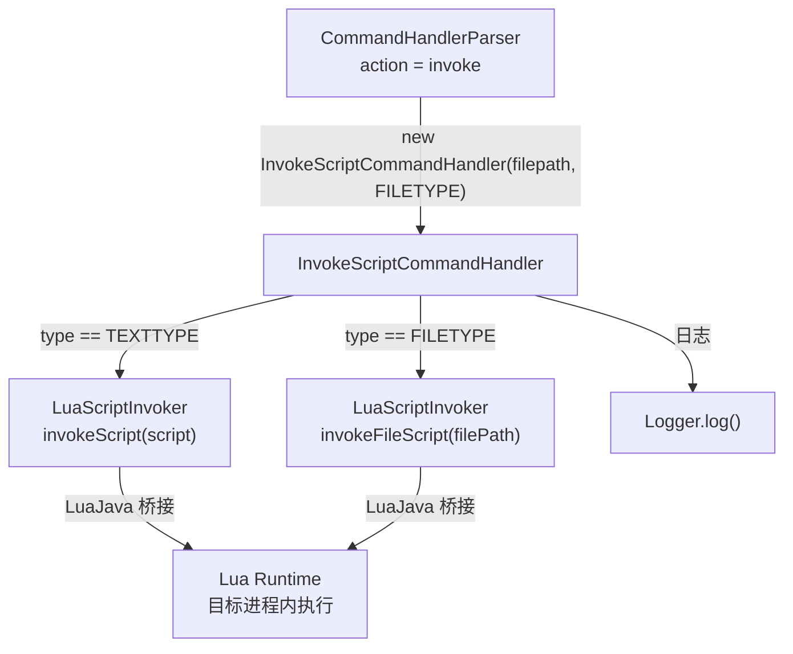

# 📝 InvokeScriptCommandHandler

> 响应 `invoke` 指令，在目标进程内部执行 Lua 脚本（支持文本和文件两种输入方式），实现可编程动态分析。

| 属性 | 值 |
|------|-----|
| 源码路径 | [InvokeScriptCommandHandler.java](https://github.com/android-security-engineer/ZjDroid-skills/blob/master/src/com/android/reverse/request/InvokeScriptCommandHandler.java) |
| 类型 | `class`（implements CommandHandler） |
| 所在包 | `com.android.reverse.request` |
| 关键依赖 | `LuaScriptInvoker`、`Logger` |

## 🎯 职责

`InvokeScriptCommandHandler` 是 ZjDroid 最具扩展性的 Handler。它将 Lua 脚本执行能力嵌入到目标进程中，让分析人员无需重新编译模块，就能通过下发脚本实现**自定义逻辑**：遍历对象、调用方法、读取字段、甚至配合 `dump_mem` 计算内存地址。

## 🔍 关键字段与方法

| 成员 | 类型 | 说明 |
|------|------|------|
| `script` | `String` | Lua 脚本文本（TEXTTYPE 时使用） |
| `filePath` | `String` | Lua 脚本文件路径（FILETYPE 时使用） |
| `type` | `ScriptType` | 脚本类型枚举值 |
| `ScriptType` | `enum` | `TEXTTYPE`（文本）/ `FILETYPE`（文件路径） |
| `InvokeScriptCommandHandler(String str, ScriptType type)` | 构造函数 | 根据类型绑定 script 或 filePath |
| `doAction()` | `void` | 按类型调用对应的 Lua 执行接口 |

## 🧠 关键实现

### 1. 内部枚举类型

```java
public static enum ScriptType {
    TEXTTYPE, FILETYPE
}
```

两种模式：
- `TEXTTYPE`：脚本内容直接以字符串形式传入（适合短脚本）
- `FILETYPE`：传入脚本文件的路径，由 LuaJava 读取文件执行（适合复杂脚本）

### 2. 构造函数的参数绑定

```java
public InvokeScriptCommandHandler(String str, ScriptType type) {
    this.type = type;
    if (type == ScriptType.TEXTTYPE)
        this.script = str;
    else if (type == ScriptType.FILETYPE)
        this.filePath = str;
}
```

根据 `type` 将 `str` 分别赋给 `script` 或 `filePath`，另一个字段保持 `null`。

### 3. doAction 的类型分发

```java
@Override
public void doAction() {
    Logger.log("The Script invoke start");
    if (this.type == ScriptType.TEXTTYPE) {
        LuaScriptInvoker.getInstance().invokeScript(script);
    } else if (this.type == ScriptType.FILETYPE) {
        LuaScriptInvoker.getInstance().invokeFileScript(filePath);
    } else {
        Logger.log("the script type is invalid");
    }
    Logger.log("The Script invoke end");
}
```

两条执行路径最终都委托给 [LuaScriptInvoker](/source/collecter/LuaScriptInvoker)，分别调用 `invokeScript()`（执行脚本字符串）或 `invokeFileScript()`（从文件加载执行）。

::: info 当前版本的分发限制
查阅 [CommandHandlerParser](/source/request/CommandHandlerParser) 源码可见，目前 `invoke` 分支只支持 `FILETYPE` 模式：

```java
} else if (ACTION_INVOKE_SCRIPT.equals(action)) {
    if (jsoncmd.has(FILE_SCRIPT)) {
        String filepath = jsoncmd.getString(FILE_SCRIPT);
        handler = new InvokeScriptCommandHandler(filepath, ScriptType.FILETYPE);
    }
}
```

`TEXTTYPE` 模式在 `InvokeScriptCommandHandler` 中已实现，但 Parser 层未提供对应分支。未来可通过扩展 Parser 支持直接传入脚本文本（如 JSON 键 `script`）来启用。
:::

::: tip 发送文件路径脚本的指令格式

```json
{"action": "invoke", "filepath": "/sdcard/myscript.lua"}
```

脚本文件需提前 push 到设备可读路径（如 `/sdcard/`）。
:::

::: warning Lua 脚本执行环境
Lua 脚本在目标进程的 Dalvik/ART 虚拟机上下文中执行，通过 LuaJava 桥接可直接操作 Java 对象。但需注意：脚本执行异常不会被 Handler 层捕获，错误处理依赖 [LuaScriptInvoker](/source/collecter/LuaScriptInvoker) 内部实现。
:::

## 🔗 调用关系



## 📌 小结

`InvokeScriptCommandHandler` 是 ZjDroid 的**可编程扩展接口**，通过 Lua 脚本在目标进程内动态执行任意逻辑。当前通过 `invoke` 指令只能触发 `FILETYPE` 模式（从文件路径加载脚本），`TEXTTYPE` 模式的代码已存在但 Parser 层尚未开放。脚本执行依赖 [LuaScriptInvoker](/source/collecter/LuaScriptInvoker) 实现。
