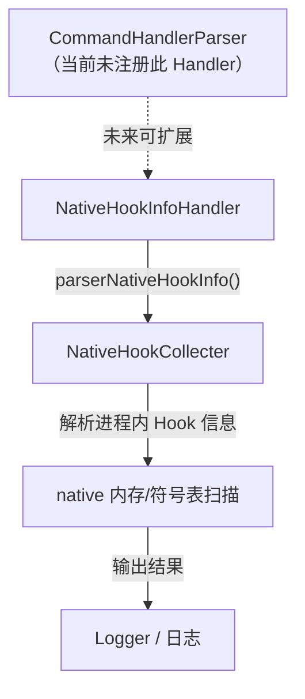

# 🪝 NativeHookInfoHandler

> 解析并输出当前进程中所有 Native Hook 的信息，用于检测和分析 native 层的 Hook 状态。

| 属性 | 值 |
|------|-----|
| 源码路径 | [NativeHookInfoHandler.java](https://github.com/android-security-engineer/ZjDroid-skills/blob/master/src/com/android/reverse/request/NativeHookInfoHandler.java) |
| 类型 | `class`（implements CommandHandler） |
| 所在包 | `com.android.reverse.request` |
| 关键依赖 | `NativeHookCollecter` |

## 🎯 职责

`NativeHookInfoHandler` 是 ZjDroid 中唯一专注于 **native 层 Hook 检测**的 Handler。它委托 [NativeHookCollecter](/source/collecter/NativeHookCollecter) 解析目标进程的 native Hook 信息，帮助分析人员了解目标 App 是否存在 native Hook（如 Inline Hook、GOT Hook 等），以及 Hook 的具体位置和特征，这对于分析加固壳、安全 SDK 等使用 native Hook 的场景尤为重要。

## 🔍 关键字段与方法

| 成员 | 类型 | 说明 |
|------|------|------|
| `doAction()` | `void` | 委托 NativeHookCollecter 解析并输出 Hook 信息 |

## 🧠 关键实现

源码极为简洁：

```java
package com.android.reverse.request;

import com.android.reverse.collecter.NativeHookCollecter;

public class NativeHookInfoHandler implements CommandHandler {

    @Override
    public void doAction() {
        NativeHookCollecter.getInstance().parserNativeHookInfo();
    }

}
```

整个 Handler 只有一行有效代码：调用 `NativeHookCollecter.getInstance().parserNativeHookInfo()`，所有实际逻辑（包括日志输出）均封装在 [NativeHookCollecter](/source/collecter/NativeHookCollecter) 中。

这是**最纯粹的委托模式**：Handler 层仅负责接收指令并转发，零业务逻辑。

::: info NativeHookInfoHandler 未在 CommandHandlerParser 中注册

查阅 [CommandHandlerParser](/source/request/CommandHandlerParser) 源码，当前的 if-else 分发链共有 7 个 action 分支，**没有**针对 `NativeHookInfoHandler` 的分支。

这意味着：
1. `NativeHookInfoHandler` 已经完整实现，但尚未对外暴露指令。
2. 无法通过 `CommandBroadcastReceiver` 的 broadcast 机制触发此 Handler。
3. 可能是预留的扩展点，或在某个未公开的分支中由其他方式调用。

若要启用，只需在 `CommandHandlerParser` 中添加类似以下代码：

```java
} else if ("native_hook_info".equals(action)) {
    handler = new NativeHookInfoHandler();
}
```
:::

::: warning 与其他 Handler 的命名差异
注意此类名为 `NativeHookInfoHandler`（后缀为 `Handler`），而其他类均以 `CommandHandler` 为后缀（如 `DumpHeapCommandHandler`）。这种命名不一致可能表明该类是在较晚阶段补充进来的，或来自不同开发者。
:::

## 🔗 调用关系



## 📌 小结

`NativeHookInfoHandler` 是实现最简洁的 Handler（仅一行有效代码），所有逻辑委托给 [NativeHookCollecter](/source/collecter/NativeHookCollecter)。值得关注的是：**此 Handler 目前并未在 [CommandHandlerParser](/source/request/CommandHandlerParser) 中注册任何 action**，无法通过标准 broadcast 指令触发，属于已实现但未对外暴露的扩展点。
