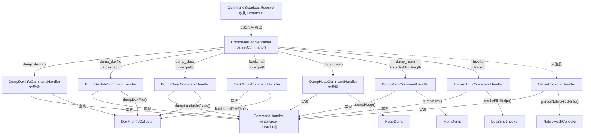

# 📦 指令处理层（request 包）

> `com.android.reverse.request` 是 ZjDroid 的**指令解析与执行中枢**，负责将外部 JSON 指令转化为具体的逆向分析操作。

## 🎯 本包整体职责

ZjDroid 通过 Android Broadcast 机制接收外部控制指令（见 [CommandBroadcastReceiver](/source/mod/CommandBroadcastReceiver)）。指令以 **JSON 字符串**传入，本包负责完成从"原始字符串"到"具体操作执行"的全链路处理。

### 命令模式（Command Pattern）的实现

本包是教科书级别的**命令模式**实现：

```
外部指令（JSON）
    ↓
CommandHandlerParser.parserCommand()    ← 解析器：提取 action，工厂方法创建 Handler
    ↓
CommandHandler（接口）                  ← 统一契约：doAction()
    ↓
XxxCommandHandler.doAction()            ← 具体 Handler：执行操作
```

**三层分离**：

| 层次 | 类 | 职责 |
|------|-----|------|
| 接口层 | `CommandHandler` | 定义唯一契约 `doAction()`，解耦调用方与实现方 |
| 分发层 | `CommandHandlerParser` | 解析 JSON，if-else 分发，充当工厂 |
| 执行层 | 各 `XxxCommandHandler` | 实现具体逆向操作，互不依赖 |

### 参数绑定时机

所有 Handler 在**构造时**即完成参数绑定（`dexpath`、`start`、`length` 等），`doAction()` 调用时无需额外参数。这是命令模式"延迟执行"的核心体现：Handler 对象本身就是一个"携带参数的待执行命令"。

## 📋 类清单

| 类名 | 类型 | action 值 | 一句话职责 |
|------|------|-----------|-----------|
| [CommandHandler](/source/request/CommandHandler) | interface | — | 统一接口，声明 `doAction()` 契约 |
| [CommandHandlerParser](/source/request/CommandHandlerParser) | class | — | 解析 JSON action 字段，分发到对应 Handler |
| [DumpDexInfoCommandHandler](/source/request/DumpDexInfoCommandHandler) | class | `dump_dexinfo` | 枚举所有已加载 DEX 的路径与 mCookie |
| [DumpDexFileCommandHandler](/source/request/DumpDexFileCommandHandler) | class | `dump_dexfile` | 将指定 DEX 从内存 dump 为 `dexdump.odex` |
| [DumpClassCommandHandler](/source/request/DumpClassCommandHandler) | class | `dump_class` | 列举指定 DEX 中所有可加载类名（带过滤） |
| [BackSmaliCommandHandler](/source/request/BackSmaliCommandHandler) | class | `backsmali` | 内存 dump + backsmali 反汇编，输出 `dexfile.dex` |
| [DumpMemCommandHandler](/source/request/DumpMemCommandHandler) | class | `dump_mem` | dump 指定内存地址段的原始字节 |
| [DumpHeapCommandHandler](/source/request/DumpHeapCommandHandler) | class | `dump_heap` | 触发 HPROF 堆快照，输出 `<pid>.hprof` |
| [InvokeScriptCommandHandler](/source/request/InvokeScriptCommandHandler) | class | `invoke` | 在目标进程内执行 Lua 脚本（文件模式） |
| [NativeHookInfoHandler](/source/request/NativeHookInfoHandler) | class | 未注册 | 解析并输出 native Hook 信息（未暴露指令） |

## 🔀 指令分发关系图



## ⚠️ 重要陷阱：README 与源码的出入

::: warning dump_mem 的参数键名

README 文档写的是 `start`，**源码实际键名是 `startaddr`**（`CommandHandlerParser.java` 第 24 行）。

```json
// ❌ README 错误示例
{"action": "dump_mem", "start": 305419896, "length": 4096}

// ✅ 正确格式
{"action": "dump_mem", "startaddr": 305419896, "length": 4096}
```

若使用错误键名，`jsoncmd.getInt("startaddr")` 将抛出 `JSONException`，指令静默失败。
:::

::: warning dump_class 分支的常量名笔误

`CommandHandlerParser` 第 54 行，`dump_class` 分支的 `getString()` 调用使用了 `PARAM_DEXPATH_DUMP_DEXFILE` 而非 `PARAM_DEXPATH_DUMPDEXCLASS`，但两个常量的值均为 `"dexpath"`，运行时行为正确，属于命名笔误不影响功能。
:::

## 🗺️ 在项目中的位置

```
ZjDroid
├── mod/           ← Xposed Hook 注入层（入口）
│   └── CommandBroadcastReceiver  ← 接收 Broadcast，调用 CommandHandlerParser
├── request/       ← 【本包】指令解析与执行层
│   ├── CommandHandler             ← 接口
│   ├── CommandHandlerParser       ← 解析/分发
│   └── *CommandHandler            ← 各具体执行器
├── collecter/     ← 数据采集层（Handler 委托对象）
│   ├── DexFileInfoCollecter
│   ├── HeapDump / MemDump
│   ├── LuaScriptInvoker
│   └── NativeHookCollecter
└── smali/         ← 内嵌 backsmali 工具链
    └── MemoryBackSmali
```

request 包处于**中间层**：上承 mod 层的广播触发，下驱 collecter 层的数据能力，是两者之间的**命令调度枢纽**。
