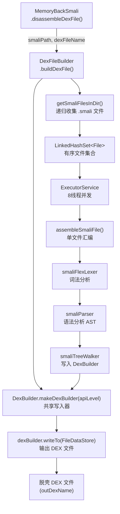

# 🏗️ DexFileBuilder

> smali 文件集合的重组器：遍历临时 smali 目录，通过 ANTLR 词法/语法分析将每个 `.smali` 文件汇编为字节码并写入最终 DEX 文件。

| 属性 | 值 |
|------|-----|
| **源码路径** | [`src/com/android/reverse/smali/DexFileBuilder.java`](https://github.com/android-security-engineer/ZjDroid-skills/blob/master/src/com/android/reverse/smali/DexFileBuilder.java) |
| **类型** | `public class`（工具类，全静态方法） |
| **所在包** | `com.android.reverse.smali` |
| **关键依赖** | `smali`（ANTLR 汇编器）、`dexlib2`（DexBuilder/FileDataStore）、[Logger](/source/util/Logger)、`ModuleContext` |

## 🎯 职责

`DexFileBuilder` 是脱壳流水线的**最后一环**，负责把 [MemoryBackSmali](/source/smali/MemoryBackSmali) 反汇编产生的 smali 文件重新编译为合法 DEX 文件：

1. 递归扫描 smali 目录收集所有 `.smali` 文件；
2. 多线程并发使用内嵌 smali 汇编器（ANTLR 驱动）解析每个文件；
3. 将所有类写入共享 `DexBuilder` 对象；
4. 最终调用 `dexBuilder.writeTo()` 生成目标 DEX 文件。

## 🔍 关键字段与方法

| 方法 | 可见性 | 说明 |
|------|--------|------|
| `buildDexFile(String smaliPath, String dexFileName)` | `public static` | 主入口，接收 smali 目录和输出 DEX 路径 |
| `getSmaliFilesInDir(File dir, Set<File> smaliFiles)` | `private static` | 递归收集目录下所有 `.smali` 文件 |
| `assembleSmaliFile(File, DexBuilder, boolean, boolean, boolean, int)` | `private static` | 单文件汇编：词法 → 语法 → AST 遍历 → 写入 DexBuilder |

## 🧠 关键实现

### 1. 收集 smali 文件

```java
LinkedHashSet<File> filesToProcess = new LinkedHashSet<File>();
File argFile = new File(smaliPath);
if (!argFile.exists()) {
    throw new RuntimeException("Cannot find file or directory \"" + smaliPath + "\"");
}
if (argFile.isDirectory()) {
    getSmaliFilesInDir(argFile, filesToProcess);
}
```

```java
private static void getSmaliFilesInDir(File dir, Set<File> smaliFiles) {
    File[] files = dir.listFiles();
    if (files != null) {
        for (File file : files) {
            if (file.isDirectory()) {
                getSmaliFilesInDir(file, smaliFiles);   // 递归
            } else if (file.getName().endsWith(".smali")) {
                smaliFiles.add(file);
            }
        }
    }
}
```

::: info 说明
使用 `LinkedHashSet` 而非 `HashSet`，保持文件的插入顺序（即文件系统遍历顺序），确保 DEX 中类的顺序与 smali 目录结构对应。
:::

### 2. 并发汇编

```java
final DexBuilder dexBuilder = DexBuilder.makeDexBuilder(apiLevel);
ExecutorService executor = Executors.newFixedThreadPool(jobs);  // jobs=8
List<Future<Boolean>> tasks = Lists.newArrayList();

for (final File file : filesToProcess) {
    tasks.add(executor.submit(new Callable<Boolean>() {
        @Override
        public Boolean call() throws Exception {
            return assembleSmaliFile(file, dexBuilder,
                    finalVerboseErrors, finalPrintTokens,
                    finalAllowOdex, finalApiLevel);
        }
    }));
}
```

::: tip 线程安全
`DexBuilder` 是 dexlib2 提供的线程安全写入器，所有并发线程共享同一实例，各自写入自己负责的类，无需外部同步。
:::

### 3. 单文件汇编：ANTLR 三阶段解析

```java
private static boolean assembleSmaliFile(File smaliFile, DexBuilder dexBuilder, ...) {
    // --- 阶段 1：词法分析 ---
    FileInputStream fis = new FileInputStream(smaliFile.getAbsolutePath());
    InputStreamReader reader = new InputStreamReader(fis, "UTF-8");
    lexer = new smaliFlexLexer(reader);
    ((smaliFlexLexer) lexer).setSourceFile(smaliFile);
    tokens = new CommonTokenStream((TokenSource) lexer);

    // --- 阶段 2：语法分析 ---
    smaliParser parser = new smaliParser(tokens);
    parser.setVerboseErrors(verboseErrors);
    parser.setAllowOdex(allowOdex);
    parser.setApiLevel(apiLevel);
    smaliParser.smali_file_return result = parser.smali_file();

    if (parser.getNumberOfSyntaxErrors() > 0 || lexer.getNumberOfSyntaxErrors() > 0) {
        return false;
    }

    // --- 阶段 3：AST 遍历 → 写入 DexBuilder ---
    CommonTree t = result.getTree();
    CommonTreeNodeStream treeStream = new CommonTreeNodeStream(t);
    treeStream.setTokenStream(tokens);
    smaliTreeWalker dexGen = new smaliTreeWalker(treeStream);
    dexGen.setVerboseErrors(verboseErrors);
    dexGen.setDexBuilder(dexBuilder);
    dexGen.smali_file();

    return dexGen.getNumberOfSyntaxErrors() == 0;
}
```

这是标准的 **ANTLR 三阶段汇编流程**：

| 阶段 | 组件 | 输出 |
|------|------|------|
| 词法分析 | `smaliFlexLexer` | Token 流 |
| 语法分析 | `smaliParser` | AST（`CommonTree`） |
| 代码生成 | `smaliTreeWalker` | 写入 `DexBuilder` |

::: warning 错误处理
任意一个阶段检测到语法错误都直接返回 `false`，对应文件被跳过。主循环收集所有错误后在 `errors` 标志上汇总，最终决定整体成败。注意：单文件失败**不会中止**其他文件的处理。
:::

### 4. 最终写出 DEX

```java
dexBuilder.writeTo(new FileDataStore(new File(dexFileName)));
Logger.log("build the dexfile ok");
return true;
```

`FileDataStore` 是 dexlib2 提供的文件输出适配器，`writeTo` 负责计算所有 section 偏移、填写 DEX header（magic、checksum、SHA-1 等），输出标准合规的 DEX 文件。

## 🔗 调用关系



## 📌 小结

`DexFileBuilder` 将 Google smali 工具链内嵌到 Android 进程内，以**纯 Java 代码**完成了通常需要 PC 端命令行工具才能做到的 smali→DEX 编译，实现了脱壳闭环。其核心是把 ANTLR 驱动的 smali 汇编器（词法+语法+AST 遍历）与 dexlib2 的 `DexBuilder` 组合，多线程并发处理保证了在目标 App 进程内的性能可接受性。
