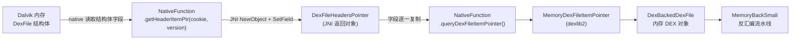

# 📐 DexFileHeadersPointer

> Dalvik DexFile 内存结构的 Java 镜像：封装 native 层回填的各 section 内存地址，作为 JNI 跨层传递 DEX 结构指针的数据载体。

| 属性 | 值 |
|------|-----|
| **源码路径** | [`src/com/android/reverse/smali/DexFileHeadersPointer.java`](https://github.com/android-security-engineer/ZjDroid-skills/blob/master/src/com/android/reverse/smali/DexFileHeadersPointer.java) |
| **类型** | `public class`（POJO 数据类） |
| **所在包** | `com.android.reverse.smali` |
| **关键依赖** | 被 [NativeFunction](/source/util/NativeFunction) 的 `getHeaderItemPtr()` 原生方法返回；为 `MemoryDexFileItemPointer`（dexlib2）提供数据 |

## 🎯 职责

`DexFileHeadersPointer` 是一个纯数据对象（DTO），专门用于**在 JNI 边界传递 DexFile 结构体各字段的内存地址**。

Android Dalvik 虚拟机在加载 DEX 文件后，会在内存中维护一个 `DexFile` C 结构体，其中记录了 StringId 列表、TypeId 列表、FieldId 列表等各 section 的起始指针。`DexFileHeadersPointer` 就是这些指针在 Java 层的镜像，由 `NativeFunction.getHeaderItemPtr()` 的 native 实现填充后返回给 Java 层。

## 🔍 关键字段与方法

| 字段 | 类型 | 含义 |
|------|------|------|
| `baseAddr` | `int` | DEX 文件在内存中的基地址 |
| `pStringIds` | `int` | StringId section 的内存地址 |
| `pTypeIds` | `int` | TypeId section 的内存地址 |
| `pFieldIds` | `int` | FieldId section 的内存地址 |
| `pMethodIds` | `int` | MethodId section 的内存地址 |
| `pProtoIds` | `int` | ProtoId section 的内存地址 |
| `pClassDefs` | `int` | ClassDef section 的内存地址 |
| `classCount` | `int` | DEX 中的类总数 |

所有字段均提供标准 getter/setter，无业务逻辑。

## 🧠 关键实现

### 1. 字段设计：32 位地址用 int 表示

```java
private int baseAddr;
private int pStringIds;
private int pTypeIds;
private int pFieldIds;
private int pMethodIds;
private int pProtoIds;
private int pClassDefs;
private int classCount;
```

::: warning 32 位地址空间
所有地址字段均使用 `int`（32 位有符号整数）。这是 Android 4.x 时代 32 位 ARM 架构的产物——Dalvik 进程地址空间为 32 位，内存地址可完整放入 `int` 中（高位为 1 时 Java 解读为负数，但在 native 层按无符号数处理）。如需移植到 64 位 ART，应改为 `long`。
:::

### 2. toString() 调试输出

```java
public String toString() {
    return "baseAddr:" + baseAddr
        + ";pStringIds:" + pStringIds
        + ";pTypeIds:" + pTypeIds
        + ";pFieldIds:" + pFieldIds
        + ";pMethodIds:" + pMethodIds
        + ";pProtoIds:" + pProtoIds
        + ";pClassDefs:" + pClassDefs;
}
```

在调试阶段通过 `Logger.log(pointer.toString())` 可以打印出完整的 DEX section 地址布局，用于验证 native 层的地址计算是否正确。

### 3. 与 MemoryDexFileItemPointer 的映射关系

在 [NativeFunction.queryDexFileItemPointer()](/source/util/NativeFunction) 中，`DexFileHeadersPointer` 的字段被逐一复制到 dexlib2 的 `MemoryDexFileItemPointer`：

```java
// NativeFunction.java 中的转换代码
DexFileHeadersPointer iteminfo = getHeaderItemPtr(cookie, version);
MemoryDexFileItemPointer pointer = new MemoryDexFileItemPointer();
pointer.setBaseAddr(iteminfo.getBaseAddr());
pointer.setpClassDefs(iteminfo.getpClassDefs());
pointer.setpFieldIds(iteminfo.getpFieldIds());
pointer.setpMethodIds(iteminfo.getpMethodIds());
pointer.setpProtoIds(iteminfo.getpProtoIds());
pointer.setpStringIds(iteminfo.getpStringIds());
pointer.setpTypeIds(iteminfo.getpTypeIds());
pointer.setClassCount(iteminfo.getClassCount());
```

`DexFileHeadersPointer` 的存在是因为 JNI 需要一个**具名 Java 类型**来返回复合数据，native 的 `getHeaderItemPtr` 在 C/C++ 侧通过 `NewObject`/`SetIntField` 等 JNI 函数创建并填充该对象后返回给 Java。

## 🔗 调用关系



## 📌 小结

`DexFileHeadersPointer` 是一个轻量级的 **JNI 数据传输对象**，它将 Dalvik C 结构体的内存布局映射到 Java POJO，充当 native 层与 Java 层之间的"数据信封"。虽然本身无业务逻辑，但它是整条脱壳链路的关键节点：没有它，dexlib2 就无法知道内存中各 DEX section 的位置，也就无法完成无文件落地的内存反汇编。
