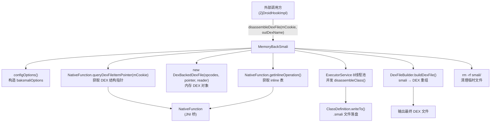

# 🔧 MemoryBackSmali

> 脱壳落地的核心调度器：从内存 DEX Cookie 出发，完成"内存读取 → baksmali 反汇编 → smali 文件落盘 → DexFileBuilder 重组 DEX"的完整流水线。

| 属性 | 值 |
|------|-----|
| **源码路径** | [`src/com/android/reverse/smali/MemoryBackSmali.java`](https://github.com/android-security-engineer/ZjDroid-skills/blob/master/src/com/android/reverse/smali/MemoryBackSmali.java) |
| **类型** | `public class`（工具类，全静态方法） |
| **所在包** | `com.android.reverse.smali` |
| **关键依赖** | `baksmali`、`dexlib2`、[NativeFunction](/source/util/NativeFunction)、[DexFileBuilder](/source/smali/DexFileBuilder)、[Logger](/source/util/Logger)、`ModuleContext` |

## 🎯 职责

`MemoryBackSmali` 是 ZjDroid 脱壳的**总指挥**，对外暴露唯一入口 `disassembleDexFile(int mCookie, String outDexName)`，内部串联了整条脱壳流水线：

1. 通过 [NativeFunction](/source/util/NativeFunction) 从 Dalvik 内存读取目标 DEX；
2. 使用内嵌的 baksmali/dexlib2 将每个类并发反汇编为 `.smali` 文件；
3. 调用 [DexFileBuilder](/source/smali/DexFileBuilder) 把 smali 重新组装为合法 DEX 文件；
4. 清理临时 smali 目录，输出最终 DEX。

## 🔍 关键字段与方法

| 方法 / 字段 | 可见性 | 说明 |
|-------------|--------|------|
| `disassembleDexFile(int mCookie, String outDexName)` | `public static` | 脱壳主入口，返回是否成功 |
| `configOptions()` | `private static` | 构造 `baksmaliOptions`，配置 API 级别、输出目录、并发数等 |
| `disassembleClass(ClassDef, ClassFileNameHandler, baksmaliOptions)` | `private static` | 单个类的反汇编任务，被线程池并发调用 |
| `getDefaultBootClassPathForApi(int apiLevel)` | `private static` | 按 API 级别返回 bootClassPath jar 列表，供类型分析使用 |

## 🧠 关键实现

### 1. 配置 baksmali 选项

```java
private static baksmaliOptions configOptions() {
    baksmaliOptions options = new baksmaliOptions();
    options.apiLevel = ModuleContext.getInstance().getApiLevel();
    options.outputDirectory = ModuleContext.getInstance().getAppContext()
            .getFilesDir().getAbsolutePath() + "/smali";
    options.allowOdex = true;
    options.deodex = true;
    options.jobs = 8;
    options.bootClassPathDirs.add("/system/framework/");
    if (options.apiLevel >= 17) {
        options.checkPackagePrivateAccess = true;
    }
    options.registerInfo = 128;
    options.useLocalsDirective = true;
    options.useSequentialLabels = true;
    options.outputDebugInfo = true;
    return options;
}
```

::: tip 关键配置点
- `outputDirectory` 写入 App 私有 `files/smali/` 目录，Xposed 宿主进程有写权限；
- `allowOdex = true` + `deodex = true` 支持 ODEX 格式解析（针对旧版 Dalvik）；
- `jobs = 8` 使用 8 线程并发，提升大 DEX 的处理速度；
- `registerInfo = 128` 开启完整寄存器分析，便于后续理解脱壳后的 smali。
:::

### 2. 从内存构造 DexBackedDexFile

```java
Opcodes opcodes = new Opcodes(ModuleContext.getInstance().getApiLevel());
MemoryReader reader = new NativeFunction();
MemoryDexFileItemPointer pointer = NativeFunction.queryDexFileItemPointer(mCookie);
DexBackedDexFile mmDexFile = new DexBackedDexFile(opcodes, pointer, reader);
```

这里是 ZjDroid 最精妙的设计：

- `NativeFunction` 同时担任两个角色：通过 `queryDexFileItemPointer` 提供 **结构指针**（各 section 地址），又作为 `MemoryReader` 实现在 `readBytes` 方法中按地址直读 Dalvik 内存；
- `DexBackedDexFile` 接受指针和读取器两个参数，便能在**不 dump DEX 文件**的情况下完成反汇编——这是绕过文件落地检测的核心手段；
- `mCookie` 是 Android DexFile 的内部句柄，native 层通过它定位 `DexFile` 结构体。

::: warning 重点
绝大多数壳会检测 `/data/data/xxx/` 目录下是否出现 .dex 文件，而此处先将 DEX **只读到内存**再反汇编，中间无文件落地，绕过了该类检测。
:::

### 3. 类型分析与 inline 解析

```java
options.bootClassPathEntries = getDefaultBootClassPathForApi(options.apiLevel);
options.classPath = ClassPath.fromClassPath(options.bootClassPathDirs,
        options.bootClassPathEntries, mmDexFile, options.apiLevel);
String inlineString = NativeFunction.getInlineOperation();
options.inlineResolver = new CustomInlineMethodResolver(
        options.classPath, inlineString);
```

- `ClassPath` 包含系统 framework jar，使 baksmali 能解析跨 DEX 的类型引用；
- `getInlineOperation()` 是另一个 JNI 方法，返回 Dalvik inline 表快照，用于正确还原被内联优化的方法调用。

### 4. 并发反汇编

```java
List<? extends ClassDef> classDefs = Ordering.natural().sortedCopy(mmDexFile.getClasses());
ExecutorService executor = Executors.newFixedThreadPool(options.jobs);
List<Future<Boolean>> tasks = new ArrayList<>();

for (final ClassDef classDef : classDefs) {
    tasks.add(executor.submit(new Callable<Boolean>() {
        @Override
        public Boolean call() throws Exception {
            return disassembleClass(classDef, fileNameHandler, options);
        }
    }));
}
```

每个类单独提交一个 `Callable` 任务，8 线程并发执行。`Ordering.natural()` 确保输出目录中文件顺序与 DEX 类列表一致，方便后续 diff。

### 5. 单类反汇编写盘

```java
private static boolean disassembleClass(ClassDef classDef, ...) {
    DexBackedClassDef classdf = (DexBackedClassDef) classDef;
    if (!classdf.isValid()) return false;
    // 验证描述符格式：必须是 L...;
    if (classDescriptor.charAt(0) != 'L'
            || classDescriptor.charAt(classDescriptor.length() - 1) != ';') {
        Logger.log("Unrecognized class descriptor ...");
        return false;
    }
    File smaliFile = fileNameHandler.getUniqueFilenameForClass(classDescriptor);
    ClassDefinition classDefinition = new ClassDefinition(options, classDef);
    BufferedWriter bufWriter = new BufferedWriter(
            new OutputStreamWriter(new FileOutputStream(smaliFile), "UTF8"));
    writer = new IndentingWriter(bufWriter);
    classDefinition.writeTo((IndentingWriter) writer);
    ...
}
```

::: info 说明
`classdf.isValid()` 是 dexlib2 对内存读取结果的有效性校验——对于被壳混淆的残缺类定义，此处直接跳过，避免解析异常导致整个任务崩溃。
:::

### 6. 重组 DEX 并清理

```java
boolean result = DexFileBuilder.buildDexFile(options.outputDirectory, outDexName);
if (result) {
    Runtime.getRuntime().exec("rm -rf " + options.outputDirectory);
}
return !errorOccurred;
```

反汇编完成后立刻调用 [DexFileBuilder](/source/smali/DexFileBuilder) 将 smali 重组为 DEX，成功后删除临时 smali 目录，节省存储空间。

### 7. BootClassPath 按 API 分级

```java
private static List<String> getDefaultBootClassPathForApi(int apiLevel) {
    List<String> list = new ArrayList<>();
    if (apiLevel < 9) {
        list.add("/system/framework/core.jar");
        ...
    } else if (apiLevel < 12) { ... }
    ...
    // API >= 16 时追加 telephony-common.jar / mms-common.jar
    return list;
}
```

`getDefaultBootClassPathForApi` 对 API 9/12/14/16/17 等多个历史版本分别配置 bootClassPath，确保 ZjDroid 在 Android 2.x ~ 4.x 全版本正常工作。

## 🔗 调用关系



## 📌 小结

`MemoryBackSmali` 是 ZjDroid 脱壳能力的**流程编排层**，自身不做内存读取也不做文件解析，而是通过精心设计的接口将 `NativeFunction`（内存读取）、`dexlib2`（DEX 解析）、`baksmali`（反汇编）、`DexFileBuilder`（重组）四个组件串联起来，形成"内存 → smali → DEX"的完整脱壳管道。其最大亮点在于**全程无 DEX 文件落地**地完成反汇编，有效规避了基于文件监控的反调试手段。
