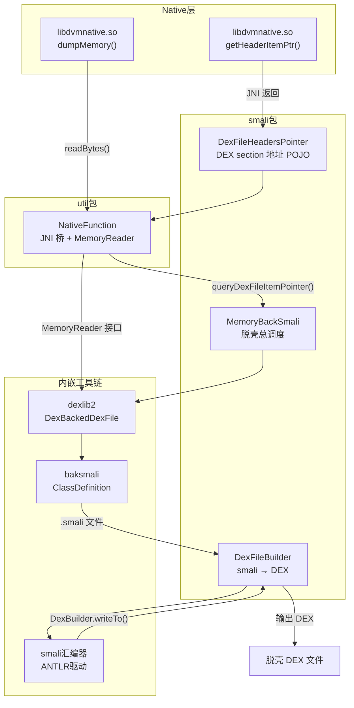
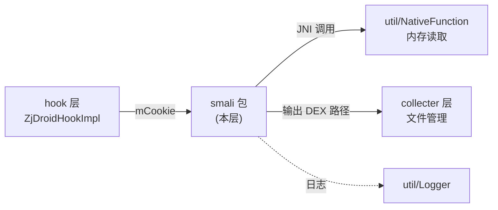

# 🔩 反汇编重组层（smali 包）

> `com.android.reverse.smali` 包承担 ZjDroid 脱壳的**核心流程**：从 Dalvik 内存 DEX Cookie 出发，完成"内存读取 → baksmali 反汇编 → smali 落盘 → DEX 重组"的完整管道，是连接底层 JNI 和上层控制器的关键层。

## 📦 包职责

| 职能 | 说明 |
|------|------|
| **内存 DEX 解析** | 通过 native 指针直接访问 Dalvik `DexFile` 结构体，无需文件落地 |
| **并发反汇编** | 8 线程并发调用内嵌 baksmali，将每个类还原为 `.smali` 文本 |
| **smali 重汇编** | 内嵌 smali 汇编器（ANTLR 驱动）将 smali 重新编译为合法 DEX |
| **结构指针封装** | 为 JNI 与 dexlib2 之间的数据传递提供 Java 类型桥梁 |

## 🗂️ 类清单

| 类名 | 职责 | 文档 |
|------|------|------|
| [MemoryBackSmali](/source/smali/MemoryBackSmali) | 脱壳流水线总调度：内存 DEX → smali → 重组 DEX | [查看](/source/smali/MemoryBackSmali) |
| [DexFileBuilder](/source/smali/DexFileBuilder) | smali 文件集合 → 合法 DEX 文件（ANTLR 汇编） | [查看](/source/smali/DexFileBuilder) |
| [DexFileHeadersPointer](/source/smali/DexFileHeadersPointer) | Dalvik DexFile section 地址的 Java POJO 封装 | [查看](/source/smali/DexFileHeadersPointer) |

## 🗺️ 包内关系图

## 🏗️ 在项目中的位置

::: tip 无文件落地的技术关键
smali 包最核心的设计决策是：在 `MemoryBackSmali` 中通过 `MemoryReader` 接口直接读取内存，`DexBackedDexFile` 对象完全在内存中构建，**无需先把 DEX dump 到磁盘**再解析。这一设计绕过了大多数壳对 `/data/data/<pkg>/` 目录的文件监控。
:::

::: info 依赖的内嵌第三方库
- **baksmali**：参见 [/internals/baksmali/](/internals/baksmali/) — 提供 `ClassDefinition`、`baksmaliOptions`
- **dexlib2**：参见 [/internals/dexlib2/](/internals/dexlib2/) — 提供 `DexBackedDexFile`、`DexBuilder`、`MemoryReader`
- **smali**：ANTLR 驱动的 smali 汇编器，提供 `smaliFlexLexer`、`smaliParser`、`smaliTreeWalker`
:::
