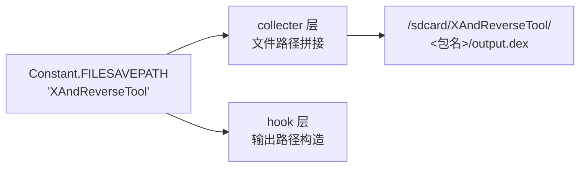

# 📌 Constant

> ZjDroid 全局常量仓库：集中定义工具输出目录名等全局配置常量，避免魔法字符串散落各处。

| 属性 | 值 |
|------|-----|
| **源码路径** | [`src/com/android/reverse/util/Constant.java`](https://github.com/android-security-engineer/ZjDroid-skills/blob/master/src/com/android/reverse/util/Constant.java) |
| **类型** | `public class`（常量类） |
| **所在包** | `com.android.reverse.util` |
| **关键依赖** | 无 |

## 🎯 职责

`Constant` 是 ZjDroid 的**全局配置常量中心**，当前定义了工具输出文件的根目录名称，供需要文件落地的模块统一引用。

## 🔍 关键字段

| 常量 | 值 | 说明 |
|------|-----|------|
| `FILESAVEPATH` | `"XAndReverseTool"` | ZjDroid 输出文件的根目录名，通常位于外部存储的该目录下 |

## 🧠 关键实现

```java
public class Constant {
    public static String FILESAVEPATH = "XAndReverseTool";
}
```

::: info 关于 FILESAVEPATH
`FILESAVEPATH = "XAndReverseTool"` 是脱壳 DEX、smali 文件等输出内容的根目录名。ZjDroid 通常将脱壳结果写入 `/sdcard/XAndReverseTool/<包名>/` 目录下，逆向人员可通过 `adb pull /sdcard/XAndReverseTool/` 导出结果。
:::

::: warning 字段声明类型
注意 `FILESAVEPATH` 声明为 `public static String`（非 `static final`），理论上允许在运行时被修改。若需防止意外修改，应改为 `public static final String`。
:::

## 🔗 调用关系



## 📌 小结

`Constant` 是最简单的基础设施类，其存在价值在于**避免魔法字符串**：将 `"XAndReverseTool"` 这个关键的输出目录名集中管理，一处修改全局生效，是良好代码组织习惯的体现。
