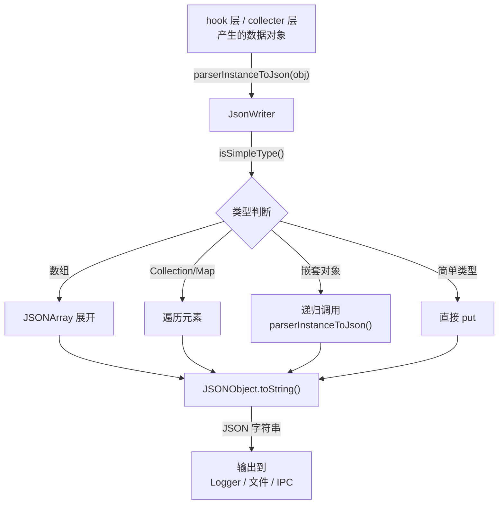

# 📄 JsonWriter

> 基于反射的通用 JSON 序列化器：无需注解或配置，递归将任意 Java 对象的字段转换为 JSON 字符串，用于脱壳结果和监控数据的输出。

| 属性 | 值 |
|------|-----|
| **源码路径** | [`src/com/android/reverse/util/JsonWriter.java`](https://github.com/android-security-engineer/ZjDroid-skills/blob/master/src/com/android/reverse/util/JsonWriter.java) |
| **类型** | `public class`（工具类，全静态） |
| **所在包** | `com.android.reverse.util` |
| **关键依赖** | `java.lang.reflect`、`org.json.JSONObject`、`org.json.JSONArray`、[Logger](/source/util/Logger) |

## 🎯 职责

`JsonWriter` 通过 Java 反射自动遍历对象的所有声明字段，将其序列化为 JSON 字符串。支持基础类型、字符串、对象数组、集合（`Collection`）、Map，以及递归嵌套对象，无需为每个数据类编写专用序列化代码。

## 🔍 关键字段与方法

| 方法 | 可见性 | 说明 |
|------|--------|------|
| `parserInstanceToJson(Object data)` | `public static` | 主入口，将任意对象序列化为 JSON 字符串 |
| `isSimpleType(Object obj)` | `private static` | 判断是否为 Java 基本包装类型或 String |
| `isSimpleTypeArray(Object obj)` | `private static` | 判断是否为基本包装类型数组 |

## 🧠 关键实现

### 1. 主序列化逻辑

```java
public static String parserInstanceToJson(Object data) throws Exception {
    if (data.getClass().isPrimitive() || isSimpleType(data)) {
        return data.toString();   // 简单类型直接 toString
    }
    JSONObject result = new JSONObject();
    Field[] fields = data.getClass().getDeclaredFields();
    for (int i = 0; i < fields.length; i++) {
        Field field = fields[i];
        field.setAccessible(true);
        Object value = field.get(data);
        // 根据字段类型分支处理 ...
    }
    return result.toString();
}
```

入口方法先处理简单类型直接返回，否则通过 `getDeclaredFields()` 获取所有声明字段（包括 `private`），逐一序列化。

### 2. 类型分发逻辑（核心）

```java
if (field.getType().isPrimitive()) {
    result.put(field.getName(), value);               // 原始类型
} else {
    if (isSimpleType(value)) {
        result.put(field.getName(), value);           // 包装类型 / String
    } else if (value == null) {
        result.put(field.getName(), null);            // null 值
    } else if (isSimpleTypeArray(value)) {
        // 基础类型数组 → JSONArray
        JSONArray arrayData = new JSONArray();
        Object[] objArray = (Object[]) value;
        for (int j = 0; j < objArray.length; j++) {
            arrayData.put(objArray[j]);
        }
        result.put(field.getName(), arrayData);
    } else if (value instanceof Object[]) {
        // 对象数组 → 递归序列化每个元素
        JSONArray arrayData = new JSONArray();
        for (int j = 0; j < objArray.length; j++) {
            arrayData.put(parserInstanceToJson(objArray[j]));
        }
        result.put(field.getName(), arrayData);
    } else if (value instanceof Collection) {
        // Collection → 逐元素处理（简单类型直接放，复杂类型递归）
        JSONArray arrayData = new JSONArray();
        Object[] objArray = ((Collection) value).toArray();
        for (int j = 0; j < objArray.length; j++) {
            if (isSimpleType(objArray[j]))
                arrayData.put(objArray[j]);
            else
                arrayData.put(parserInstanceToJson(objArray[j]));
        }
        result.put(field.getName(), arrayData);
    } else if (value instanceof Map) {
        // Map → [{key:..., value:...}] 数组格式
        JSONArray arrayData = new JSONArray();
        Object[] keyArray = map.keySet().toArray();
        for (int j = 0; j < keyArray.length; j++) {
            JSONObject obj = new JSONObject();
            obj.put("key", parserInstanceToJson(keyArray[j]));
            obj.put("value", parserInstanceToJson(map.get(keyArray[j])));
            arrayData.put(obj);
        }
        result.put(field.getName(), arrayData);
    } else if (value instanceof Object) {
        // 其他对象 → 递归序列化
        result.put(field.getName(), parserInstanceToJson(value));
    } else {
        Logger.log("the field:" + field.getName() + " can't covert to json");
    }
}
```

类型分发优先级（从高到低）：

| 优先级 | 类型判断 | 处理方式 |
|--------|---------|---------|
| 1 | 原始类型（`isPrimitive()`） | 直接 put |
| 2 | 简单包装类型 / String | 直接 put |
| 3 | `null` | put null |
| 4 | 基础包装类型数组 | 展开为 JSONArray |
| 5 | `Object[]` | 递归各元素 |
| 6 | `Collection` | 转数组后递归 |
| 7 | `Map` | 转 `[{key,value}]` 格式 |
| 8 | 其他 `Object` | 递归序列化 |

::: warning Map 序列化格式
`Map` 被序列化为 `[{"key": ..., "value": ...}]` 的数组格式（而非标准的 `{"k1": v1, "k2": v2}`），这是因为 Map 的 key 可能不是 String 类型，需要通用表示。使用时需注意这个非常规格式。
:::

### 3. 简单类型判断

```java
private static boolean isSimpleType(Object obj) {
    if (obj instanceof Integer || obj instanceof Long || obj instanceof Double
            || obj instanceof Float || obj instanceof Byte
            || obj instanceof Short || obj instanceof Character
            || obj instanceof Boolean || obj instanceof String) {
        return true;
    }
    return false;
}
```

覆盖了 Java 所有 8 种基本类型的包装类加 `String`，这些类型可以安全地调用 `toString()` 或直接放入 JSONObject。

## 🔗 调用关系



## 📌 小结

`JsonWriter` 是 ZjDroid 的**通用数据序列化工具**，其价值在于无需为每个数据类手写序列化逻辑——通过 Java 反射动态遍历字段，结合递归的类型分发，即可将任意复杂度的对象图序列化为 JSON。这在逆向工程工具中尤为实用：分析过程中数据结构随时可能变化，无需维护序列化代码。
