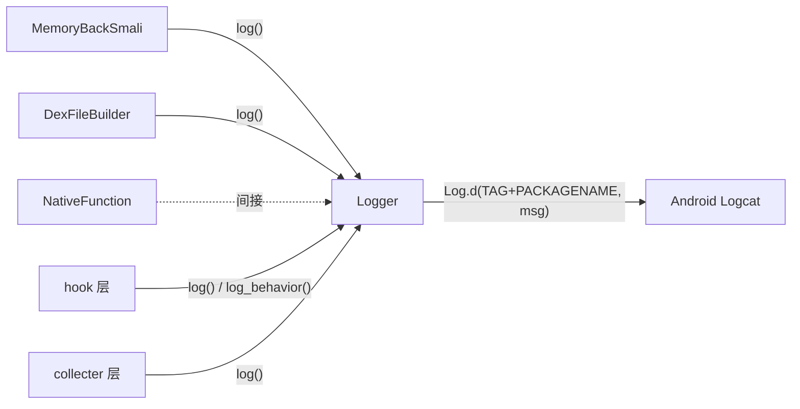

# 📋 Logger

> ZjDroid 统一日志门面：通过 Android Logcat 输出调试信息，用包名动态拼接 TAG，同时支持通用日志和行为监控两个日志通道。

| 属性 | 值 |
|------|-----|
| **源码路径** | [`src/com/android/reverse/util/Logger.java`](https://github.com/android-security-engineer/ZjDroid-skills/blob/master/src/com/android/reverse/util/Logger.java) |
| **类型** | `public class`（工具类，全静态） |
| **所在包** | `com.android.reverse.util` |
| **关键依赖** | `android.util.Log` |

## 🎯 职责

`Logger` 是 ZjDroid 全项目统一的日志工具，提供两个输出通道，并支持通过 `DEBUG_ENABLE` 开关全局关闭日志，避免在生产环境泄露分析信息。

## 🔍 关键字段与方法

| 字段 / 方法 | 类型 | 说明 |
|-------------|------|------|
| `LOGTAG_COMMAN` | `public static String` | 通用日志 TAG 前缀：`"zjdroid-shell-"` |
| `LOGTAG_WORKFLOW` | `public static String` | 行为监控日志 TAG 前缀：`"zjdroid-apimonitor-"` |
| `DEBUG_ENABLE` | `public static boolean` | 全局日志开关，默认 `true` |
| `PACKAGENAME` | `public static String` | 当前被 Hook 的包名（由外部注入） |
| `log(String)` | `public static void` | 通用调试日志，TAG 为 `LOGTAG_COMMAN + PACKAGENAME` |
| `log_behavior(String)` | `public static void` | API 行为监控日志，TAG 为 `LOGTAG_WORKFLOW + PACKAGENAME` |

## 🧠 关键实现

### 1. TAG 动态拼接

```java
public static String LOGTAG_COMMAN  = "zjdroid-shell-";
public static String LOGTAG_WORKFLOW = "zjdroid-apimonitor-";
public static String PACKAGENAME;

public static void log(String message) {
    if (DEBUG_ENABLE)
        Log.d(LOGTAG_COMMAN + PACKAGENAME, message);
}

public static void log_behavior(String message) {
    if (DEBUG_ENABLE)
        Log.d(LOGTAG_WORKFLOW + PACKAGENAME, message);
}
```

TAG 格式为 `zjdroid-shell-<包名>` 和 `zjdroid-apimonitor-<包名>`。这样设计有两个优点：

- 同时 Hook 多个 App 时，通过 TAG 中的包名可以精确过滤目标 App 的日志；
- 使用 `adb logcat -s zjdroid-shell-com.target.app` 即可只看该 App 的脱壳日志。

::: tip 使用 adb 过滤日志
```bash
# 查看脱壳过程日志
adb logcat -s zjdroid-shell-com.target.app

# 查看 API 行为监控日志
adb logcat -s zjdroid-apimonitor-com.target.app
```
:::

### 2. 全局开关

```java
public static boolean DEBUG_ENABLE = true;
```

通过将 `DEBUG_ENABLE` 设为 `false`，可以一次性关闭 ZjDroid 的所有日志输出。由于是 `public static` 字段，理论上也可以在运行时通过 Xposed 动态修改。

### 3. 两个日志通道的分工

| 通道 | 方法 | 用途 | TAG 示例 |
|------|------|------|----------|
| 通用 | `log()` | 脱壳流程、错误信息 | `zjdroid-shell-com.target.app` |
| 行为 | `log_behavior()` | API 调用监控（用于分析壳行为） | `zjdroid-apimonitor-com.target.app` |

`log_behavior` 主要被 ZjDroid 的 API 监控模块调用，记录被 Hook 的系统 API 的调用情况，例如加密/解密操作、文件 I/O 等，便于逆向分析人员理解壳的保护逻辑。

## 🔗 调用关系



## 📌 小结

`Logger` 虽然代码极简（仅 23 行），却承担了 ZjDroid 全局日志基础设施的职责。其核心设计是**将目标包名动态拼入 TAG**，在同时分析多个 App 时保持日志可区分性；同时通过双通道分离脱壳日志和行为监控日志，使分析人员能有针对性地过滤感兴趣的信息。
