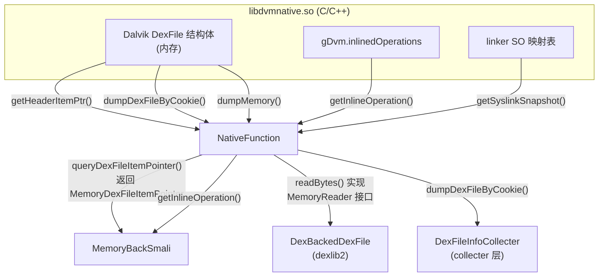

# ⚡ NativeFunction

> ZjDroid 的 JNI 核心桥梁：加载 `libdvmnative.so`，声明所有访问 Dalvik 内存的 native 方法，并实现 `MemoryReader` 接口，是整个脱壳体系的底层基石。

| 属性 | 值 |
|------|-----|
| **源码路径** | [`src/com/android/reverse/util/NativeFunction.java`](https://github.com/android-security-engineer/ZjDroid-skills/blob/master/src/com/android/reverse/util/NativeFunction.java) |
| **类型** | `public class`，实现 `MemoryReader` 接口 |
| **所在包** | `com.android.reverse.util` |
| **关键依赖** | `libdvmnative.so`（native 实现）、dexlib2 的 `MemoryReader` / `MemoryDexFileItemPointer`、[DexFileHeadersPointer](/source/smali/DexFileHeadersPointer)、`ModuleContext` |

## 🎯 职责

`NativeFunction` 承担三重职责：

1. **Native 库加载**：通过静态块加载 `libdvmnative.so`，初始化 JNI 绑定；
2. **Dalvik 内存访问接口**：声明 5 个 `native` 方法，直接操作 Dalvik 虚拟机内部数据结构；
3. **MemoryReader 实现**：将 `dumpMemory()` 包装成 dexlib2 所需的 `readBytes(int offset, int length)` 接口，使 dexlib2 能够透明地从内存读取 DEX 数据。

::: tip 为何是核心
没有 `NativeFunction`，ZjDroid 便无法绕过 ClassLoader 的双亲委派访问被壳保护的内存区域。它是"主动内存读取"能力的唯一来源。
:::

## 🔍 关键字段与方法

| 方法 / 字段 | 类型 | 说明 |
|-------------|------|------|
| `DVMNATIVE_LIB` | `private static final String` | native 库名称常量 `"dvmnative"` |
| `dumpDexFileByClass(Class, int)` | `public static native` | 通过类引用定位所在 DEX 并 dump 内存 |
| `dumpDexFileByCookie(int cookie, int version)` | `public static native` | 通过 DEX Cookie 直接 dump 整个 DEX 内存 |
| `dumpMemory(int start, int length)` | `public static native` | 按地址和长度读取任意 Dalvik 内存段 |
| `getHeaderItemPtr(int cookie, int version)` | `private static native` | 获取 DexFile 结构体各 section 地址 |
| `getInlineOperation()` | `public static native` | 获取 Dalvik inline 方法替换表快照 |
| `getSyslinkSnapshot()` | `public static native` | 获取系统动态链接库快照（用于 API 监控） |
| `readBytes(int offset, int length)` | `public`（接口实现） | 调用 `dumpMemory` 返回 byte 数组（供 dexlib2 使用） |
| `queryDexFileItemPointer(int cookie)` | `public static` | 桥接方法：将 native 返回的结构指针转换为 dexlib2 对象 |

## 🧠 关键实现

### 1. 静态初始化加载 native 库

```java
private final static String DVMNATIVE_LIB = "dvmnative";

static {
    System.loadLibrary(DVMNATIVE_LIB);
}
```

静态块在类首次加载时执行，通过 `System.loadLibrary("dvmnative")` 加载 `libdvmnative.so`。该 SO 文件打包在 ZjDroid 模块 APK 的 `lib/` 目录下，由 Android 系统负责解压和加载。

::: warning JNI 初始化时机
由于 ZjDroid 是 Xposed 模块，`NativeFunction` 的类加载发生在 `handleLoadPackage` 回调中，此时宿主 App 已启动但尚未执行业务代码，确保 native 库在脱壳动作开始前完成绑定。
:::

### 2. 核心 native 方法声明

```java
public static native ByteBuffer dumpDexFileByClass(Class classInDex, int version);
public static native ByteBuffer dumpDexFileByCookie(int cookie, int version);
public static native ByteBuffer dumpMemory(int start, int length);
private static native DexFileHeadersPointer getHeaderItemPtr(int cookie, int version);
public static native String getInlineOperation();
public static native HashMap getSyslinkSnapshot();
```

这 6 个方法均由 `libdvmnative.so` 实现，其工作原理：

| 方法 | native 侧行为 |
|------|--------------|
| `dumpDexFileByCookie` | 通过 cookie（Dalvik `DexFile*` 指针）访问 `DexFile` 结构体，将整块 DEX 内存复制为 `ByteBuffer` |
| `dumpDexFileByClass` | 通过 JNI 的 `GetObjectClass` → `FindClass` 找到类所在 DEX，再 dump |
| `dumpMemory` | 直接按起始地址+长度 `memcpy` 一段内存到 `ByteBuffer` |
| `getHeaderItemPtr` | 解析 `DexFile` 结构体中的 `pHeader`、`pStringIds` 等指针字段，填充 `DexFileHeadersPointer` 对象 |
| `getInlineOperation` | 读取 `gDvm.inlinedOperations` 数组，序列化为字符串 |
| `getSyslinkSnapshot` | 遍历 `/proc/self/maps` 或 linker 内部列表，返回已加载 SO 的地址映射 |

### 3. MemoryReader 接口实现

```java
public byte[] readBytes(int arg0, int arg1) {
    ByteBuffer data = dumpMemory(arg0, arg1);
    data.order(ByteOrder.LITTLE_ENDIAN);
    byte[] buffer = new byte[data.capacity()];
    data.get(buffer, 0, data.capacity());
    return buffer;
}
```

这是 `NativeFunction` 实现 dexlib2 `MemoryReader` 接口的关键方法：

- `arg0` 为内存起始地址，`arg1` 为读取长度（均为相对于 DEX 基址的**偏移量**）；
- `dumpMemory` 的 native 实现将对应内存块复制为 `ByteBuffer`；
- 设置 `ByteOrder.LITTLE_ENDIAN` 匹配 ARM 字节序；
- 返回的 `byte[]` 供 dexlib2 解析 DEX 结构（string、type、method、field 等）。

::: info dexlib2 与 MemoryReader 的解耦
dexlib2 的 `DexBackedDexFile` 通过 `MemoryReader` 接口访问 DEX 数据，而不是直接读文件。`NativeFunction` 实现该接口，让 dexlib2 在**不知道数据来源**的情况下完成解析——数据可以来自文件、也可以来自内存，完全透明。
:::

### 4. 结构指针查询桥接

```java
public static MemoryDexFileItemPointer queryDexFileItemPointer(int cookie) {
    int version = ModuleContext.getInstance().getApiLevel();
    DexFileHeadersPointer iteminfo = getHeaderItemPtr(cookie, version);
    MemoryDexFileItemPointer pointer = new MemoryDexFileItemPointer();
    pointer.setBaseAddr(iteminfo.getBaseAddr());
    pointer.setpClassDefs(iteminfo.getpClassDefs());
    pointer.setpFieldIds(iteminfo.getpFieldIds());
    pointer.setpMethodIds(iteminfo.getpMethodIds());
    pointer.setpProtoIds(iteminfo.getpProtoIds());
    pointer.setpStringIds(iteminfo.getpStringIds());
    pointer.setpTypeIds(iteminfo.getpTypeIds());
    pointer.setClassCount(iteminfo.getClassCount());
    return pointer;
}
```

`queryDexFileItemPointer` 是 native 层与 dexlib2 之间的**适配器**：

1. 调用 `getHeaderItemPtr`（private native）获取 [DexFileHeadersPointer](/source/smali/DexFileHeadersPointer)（自定义 POJO）；
2. 将其字段逐一复制到 dexlib2 的 `MemoryDexFileItemPointer`；
3. 返回给 [MemoryBackSmali](/source/smali/MemoryBackSmali) 使用。

这种两步转换的设计使 JNI 方法只需依赖自定义的简单 POJO（`DexFileHeadersPointer`），而将对 dexlib2 类型的依赖封装在纯 Java 方法中，降低了 native 代码的耦合度。

## 🔗 调用关系



## 📌 小结

`NativeFunction` 是 ZjDroid 整个脱壳体系的**最底层**，也是最关键的一环。它通过 JNI 直接访问 Dalvik 虚拟机的内部数据结构（无需依赖任何公开 Android API），实现了"从内存中直接读取被壳保护的 DEX"的核心能力。其设计精髓在于：同时扮演**数据提供者**（native 方法集合）和**接口实现者**（MemoryReader），使上层的 dexlib2 可以零感知地将内存当文件读取。
