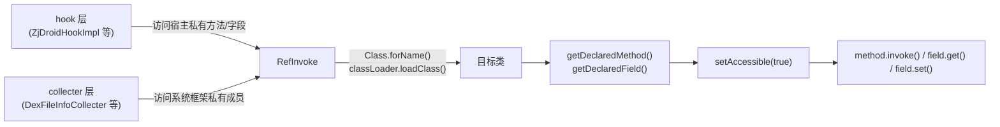

# 🔍 RefInvoke

> Java 反射工具箱：统一封装字段读写、方法调用（静态/实例/声明方法）等反射操作，屏蔽繁琐的异常处理，供 ZjDroid 各模块访问宿主 App 的私有 API。

| 属性 | 值 |
|------|-----|
| **源码路径** | [`src/com/android/reverse/util/RefInvoke.java`](https://github.com/android-security-engineer/ZjDroid-skills/blob/master/src/com/android/reverse/util/RefInvoke.java) |
| **类型** | `public class`（工具类，全静态方法） |
| **所在包** | `com.android.reverse.util` |
| **关键依赖** | `java.lang.reflect`、`de.robv.android.xposed.XposedBridge`（import，但本类方法未直接调用） |

## 🎯 职责

在 Xposed 框架中，Hook 代码需要大量访问宿主 App 或 Android 系统框架中的**私有/包私有字段和方法**，直接反射调用又要重复书写大量 try-catch 样板代码。`RefInvoke` 将这些模式抽象为简洁的静态工具方法，让调用方只需一行代码即可完成反射操作。

## 🔍 关键字段与方法

| 方法 | 说明 |
|------|------|
| `findMethodExact(String, ClassLoader, String, Class<?>...)` | 通过类名+ClassLoader 查找精确方法，返回可访问的 `Method` |
| `invokeStaticMethod(String, String, Class[], Object[])` | 反射调用静态方法，返回结果 |
| `invokeMethod(String, String, Object, Class[], Object[])` | 反射调用实例方法，返回结果 |
| `invokeDeclaredMethod(String, String, Object, Class[], Object[])` | 同上，使用 `getDeclaredMethod`（访问私有方法） |
| `getFieldInt(String, Object, String)` | 读取 `int` 类型字段值，失败返回 `-1` |
| `getFieldOjbect(String, Object, String)` | 读取实例字段对象值 |
| `getStaticFieldOjbect(String, String)` | 读取静态字段对象值 |
| `setFieldOjbect(String, String, Object, Object)` | 设置实例字段对象值 |
| `setFieldInt(String, String, Object, int)` | 设置 `int` 类型实例字段值 |
| `setStaticOjbect(String, String, Object)` | 设置静态字段对象值 |

## 🧠 关键实现

### 1. findMethodExact：通过 ClassLoader 查找方法

```java
public static Method findMethodExact(String className, ClassLoader classLoader,
        String methodName, Class<?>... parameterTypes) {
    try {
        Class clazz = classLoader.loadClass(className);
        Method method = clazz.getDeclaredMethod(methodName, parameterTypes);
        method.setAccessible(true);
        return method;
    } catch (NoSuchMethodException e) {
        e.printStackTrace();
    } catch (ClassNotFoundException e) {
        e.printStackTrace();
    }
    return null;
}
```

与其他方法使用 `Class.forName()` 不同，`findMethodExact` 接受外部传入的 `ClassLoader`，用于访问**宿主 App 的 ClassLoader** 中才能加载的类——这在 Xposed 场景中至关重要，因为宿主的类不在 ZjDroid 模块的类路径中。

### 2. 反射调用静态方法

```java
public static Object invokeStaticMethod(String class_name, String method_name,
        Class[] pareTyple, Object[] pareVaules) {
    try {
        Class obj_class = Class.forName(class_name);
        Method method = obj_class.getDeclaredMethod(method_name, pareTyple);
        method.setAccessible(true);
        return method.invoke(null, pareVaules);
    } catch (...) { ... }
    return null;
}
```

`method.invoke(null, pareVaules)` 中第一个参数为 `null` 表示静态方法调用。`setAccessible(true)` 绕过 Java 访问控制，可调用 `private static` 方法。

### 3. 字段读写：getFieldInt 与 setFieldOjbect

```java
public static int getFieldInt(String class_name, Object obj, String filedName) {
    try {
        Class obj_class = Class.forName(class_name);
        Field field = obj_class.getDeclaredField(filedName);
        field.setAccessible(true);
        return field.getInt(obj);
    } catch (...) { ... }
    return -1;   // 失败哨兵值
}

public static void setFieldOjbect(String classname, String filedName,
        Object obj, Object filedVaule) {
    try {
        Class obj_class = Class.forName(classname);
        Field field = obj_class.getDeclaredField(filedName);
        field.setAccessible(true);
        field.set(obj, filedVaule);
    } catch (...) { ... }
}
```

::: warning 命名拼写
注意源码中字段名参数为 `filedName`（非 `fieldName`），`filedVaule`（非 `fieldValue`）——这是原始代码中的拼写习惯，使用时需保持一致。
:::

### 4. 静态字段操作

```java
public static Object getStaticFieldOjbect(String class_name, String filedName) {
    // field.get(null) — null 表示静态字段
    return field.get(null);
}

public static void setStaticOjbect(String class_name, String filedName, Object filedVaule) {
    // field.set(null, filedVaule) — null 表示静态字段
    field.set(null, filedVaule);
}
```

对静态字段，`Field.get(null)` 和 `Field.set(null, value)` 是标准用法——`null` 作为实例参数表示操作类级别的静态成员。

### 5. 统一的异常处理模式

所有方法均采用相同的异常处理策略：

```java
} catch (SecurityException e)         { e.printStackTrace(); }
  catch (IllegalArgumentException e)   { e.printStackTrace(); }
  catch (IllegalAccessException e)     { e.printStackTrace(); }
  catch (NoSuchMethodException e)      { e.printStackTrace(); }
  catch (InvocationTargetException e)  { e.printStackTrace(); }
  catch (ClassNotFoundException e)     { e.printStackTrace(); }
```

::: info 设计取舍
该设计将所有异常**静默打印**后返回 `null`/`-1`，使调用方代码极其简洁，但也意味着调用方必须对返回值做非 null 检查，否则可能引发 NPE。在 Xposed 脱壳场景下，这是可接受的权衡。
:::

## 🔗 调用关系



## 📌 小结

`RefInvoke` 是 ZjDroid 的**反射瑞士军刀**，将 Java 反射的样板代码封装为可读性强的工具方法。其核心价值在于统一处理了反射调用中必须面对的 6 种异常，以及通过 `setAccessible(true)` 统一绕过 Java 访问控制，让上层业务代码专注于逻辑而非反射细节。
