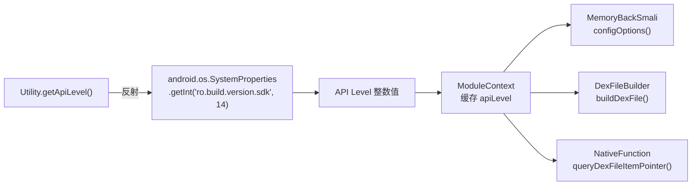

# 🛠️ Utility

> 系统属性反射工具：通过反射访问 `android.os.SystemProperties` 获取设备 API Level，绕过该类未公开的访问限制。

| 属性 | 值 |
|------|-----|
| **源码路径** | [`src/com/android/reverse/util/Utility.java`](https://github.com/android-security-engineer/ZjDroid-skills/blob/master/src/com/android/reverse/util/Utility.java) |
| **类型** | `public class`（工具类，全静态） |
| **所在包** | `com.android.reverse.util` |
| **关键依赖** | `java.lang.reflect`、`android.os.SystemProperties`（通过反射访问） |

## 🎯 职责

`Utility` 当前仅包含一个方法 `getApiLevel()`，用于通过反射读取 Android 系统属性 `ro.build.version.sdk`，从而获取设备的 API Level 整数值。

::: info 为什么用反射？
`android.os.SystemProperties` 是 Android 系统的隐藏 API（`@hide`），在普通 App 的编译环境中不可直接调用，必须通过反射访问。ZjDroid 通过这种方式绕过了隐藏 API 限制，直接读取系统属性。
:::

## 🔍 关键字段与方法

| 方法 | 可见性 | 说明 |
|------|--------|------|
| `getApiLevel()` | `public static int` | 反射读取 `ro.build.version.sdk`，失败时返回默认值 14 |

## 🧠 关键实现

### getApiLevel：反射读取系统属性

```java
public static int getApiLevel() {
    try {
        Class<?> mClassType = Class.forName("android.os.SystemProperties");
        Method mGetIntMethod = mClassType.getDeclaredMethod("getInt",
                String.class, int.class);
        mGetIntMethod.setAccessible(true);
        return (Integer) mGetIntMethod.invoke(null, "ro.build.version.sdk", 14);
    } catch (ClassNotFoundException e)      { e.printStackTrace(); }
      catch (NoSuchMethodException e)       { e.printStackTrace(); }
      catch (IllegalArgumentException e)    { e.printStackTrace(); }
      catch (IllegalAccessException e)      { e.printStackTrace(); }
      catch (InvocationTargetException e)   { e.printStackTrace(); }
    return 14;
}
```

调用链解析：

1. `Class.forName("android.os.SystemProperties")` — 加载隐藏系统类；
2. `getDeclaredMethod("getInt", String.class, int.class)` — 找到 `SystemProperties.getInt(String key, int def)` 方法；
3. `setAccessible(true)` — 绕过访问限制；
4. `invoke(null, "ro.build.version.sdk", 14)` — 静态调用，传入属性名和默认值 14（对应 Android 4.0）；
5. 出现任何异常时返回默认值 `14`，确保兼容性。

::: tip 默认值的含义
默认值 `14` 对应 Android 4.0（Ice Cream Sandwich），是 ZjDroid 支持的最低 API Level。当反射失败时使用此值，使工具在异常情况下仍能以最保守的兼容配置运行。
:::

### 与 ModuleContext 的关系

`Utility.getApiLevel()` 通常在 `ModuleContext` 初始化阶段被调用一次，结果缓存到 `ModuleContext.apiLevel` 字段中。后续 [MemoryBackSmali](/source/smali/MemoryBackSmali)、[DexFileBuilder](/source/smali/DexFileBuilder)、[NativeFunction](/source/util/NativeFunction) 均通过 `ModuleContext.getInstance().getApiLevel()` 获取该值，而非重复调用反射。

## 🔗 调用关系



## 📌 小结

`Utility` 是 ZjDroid 中最精简的工具类，专注解决**隐藏 API 访问**这一具体问题。通过反射绕过 `android.os.SystemProperties` 的访问限制，为整个工具链提供设备 API Level 这一关键环境参数，是 ZjDroid 多版本 Android 兼容能力的基础。
