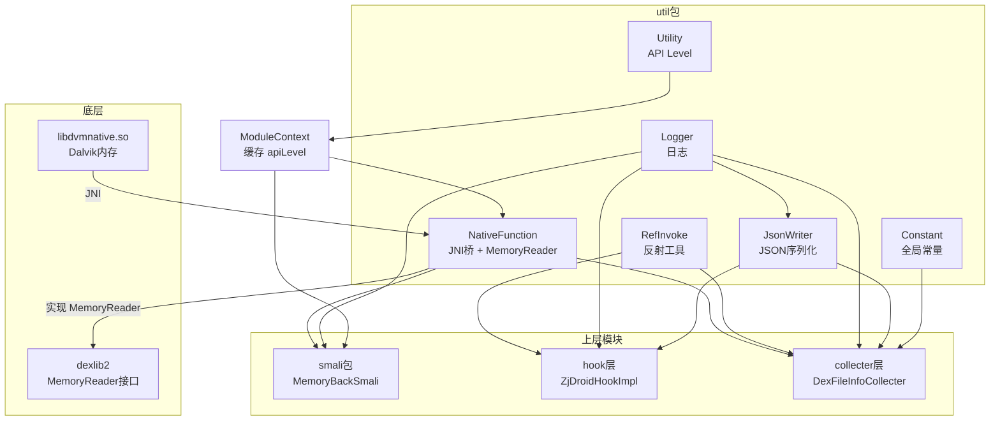
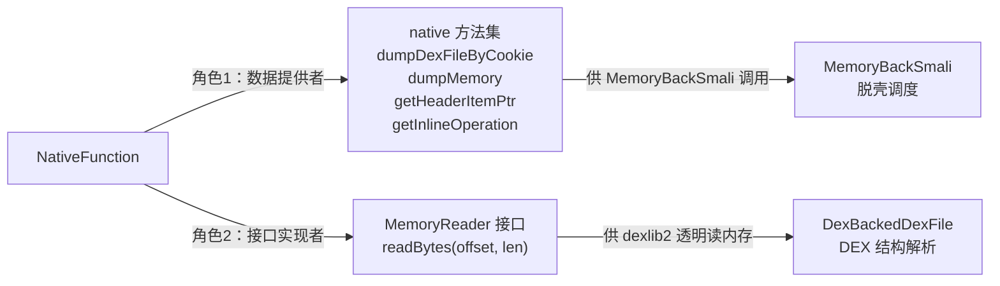
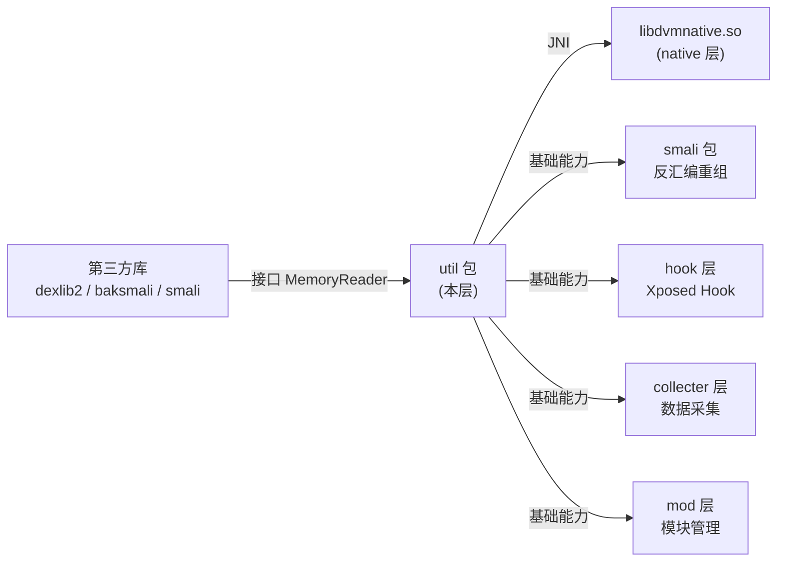

# 🧰 工具层（util 包）

> `com.android.reverse.util` 包是 ZjDroid 的**基础设施层**，为上层的脱壳执行、Hook 控制、数据采集等模块提供 JNI 内存访问、Java 反射调用、日志输出、JSON 序列化等通用能力。

## 📦 包职责

| 职能 | 说明 |
|------|------|
| **内存访问** | 通过 JNI 调用 `libdvmnative.so`，直接读取 Dalvik 虚拟机内部的 DEX 内存数据 |
| **反射调用** | 统一封装 Java 反射 API，提供字段读写、方法调用等能力，访问宿主 App 私有成员 |
| **日志管理** | 通过 Logcat 输出双通道日志（脱壳日志 + API 行为日志），支持全局开关 |
| **数据序列化** | 基于反射的通用 JSON 序列化器，无需注解即可序列化任意对象 |
| **系统信息** | 反射读取隐藏系统 API，获取设备 API Level 等环境参数 |
| **全局常量** | 集中管理输出目录等全局配置，避免魔法字符串 |

## 🗂️ 类清单

| 类名 | 职责 | 重要性 | 文档 |
|------|------|--------|------|
| [NativeFunction](/source/util/NativeFunction) | JNI 桥梁 + MemoryReader 实现，脱壳底层核心 | ⭐⭐⭐ | [查看](/source/util/NativeFunction) |
| [RefInvoke](/source/util/RefInvoke) | 统一反射工具箱：方法调用、字段读写 | ⭐⭐⭐ | [查看](/source/util/RefInvoke) |
| [Logger](/source/util/Logger) | Logcat 双通道日志，包名动态 TAG | ⭐⭐ | [查看](/source/util/Logger) |
| [JsonWriter](/source/util/JsonWriter) | 基于反射的通用 JSON 序列化器 | ⭐⭐ | [查看](/source/util/JsonWriter) |
| [Utility](/source/util/Utility) | 反射读取 `SystemProperties` 获取 API Level | ⭐ | [查看](/source/util/Utility) |
| [Constant](/source/util/Constant) | 全局常量：输出目录名 `XAndReverseTool` | ⭐ | [查看](/source/util/Constant) |

## 🗺️ 包内关系图

## 🔑 核心：NativeFunction 的双重角色

::: tip util 包的设计哲学
util 包遵循"单一职责 + 无状态"的设计原则：每个类只做一件事，所有方法均为静态，没有实例字段（`NativeFunction` 实现接口除外）。这使得上层模块可以直接调用工具方法而无需管理对象生命周期。
:::

::: warning NativeFunction 是 ZjDroid 的脱壳核心
在整个 util 包中，`NativeFunction` 的重要性远超其他类——它是 ZjDroid 能够"看见"被壳保护的 DEX 内容的唯一技术手段。其他类（`RefInvoke`、`Logger` 等）在功能上是通用工具，而 `NativeFunction` 是 ZjDroid 所独有的、直接决定脱壳成败的核心组件。
:::

## 🏗️ 在项目中的位置

